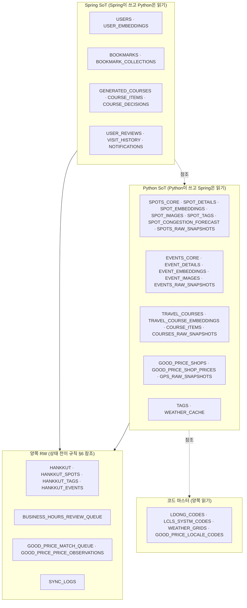
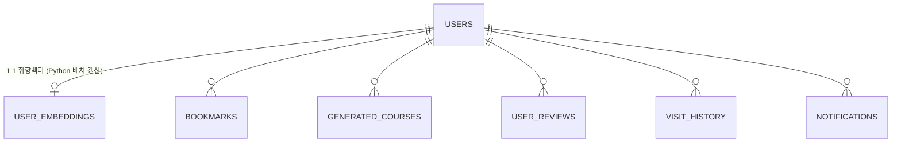
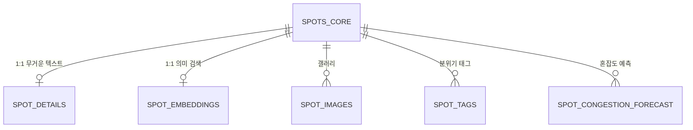

> **이 문서를 읽는 사람**: Spring Boot 개발자 (이 DB를 처음 쓰는 분)
> **목적**: 30+ 테이블의 도메인·소유권·관습을 10분 안에 파악해서 곧바로 코드 작성 가능하게
> **참고**: `docs/erd.md` (전체 ERD), `docs/operation.md` (운영 정책 SoT), `docs/proposal.md` (서비스 제안)

---

## 0. 한눈에

| 항목 | 값 |
|---|---|
| DB | PostgreSQL 16 + PostGIS + pgvector + pg_trgm |
| 규모 | 30+ 테이블 / 12개 도메인 |
| DDL 관리 | **Alembic 단독** (Python 레포) — Spring은 `ddl-auto: validate` |
| 시간대 | 모든 시각 컬럼 `TIMESTAMPTZ` (DB는 UTC, 표시는 앱 레이어에서 KST) |
| 마스터 데이터 SoT | Python 파이프라인 (TourAPI 등에서 적재) |
| 사용자 데이터 SoT | Spring 백엔드 |

⚠️ **두 가지만 절대 하지 마세요**:
1. `ddl-auto: update` / `create` — Alembic과 충돌해 사고 직결
2. 마스터 데이터(SPOTS_*, EVENTS_*, TRAVEL_*) INSERT/UPDATE/DELETE — Python이 SoT

---

## 1. 도메인 12개 — 누가 쓰는가



---

## 2. Spring이 자주 만질 도메인 빠른 참조

### 2-1. 사용자 (USERS / USER_EMBEDDINGS)



| 키 사항 | 내용 |
|---|---|
| 인증 | 카카오/네이버/구글 OAuth, `(provider, external_id)` 복합 UK |
| Soft delete | `deleted_at`, 30일 유예 후 hard delete cron |
| 익명 사용자 | 운영 안 함 (비로그인은 콘텐츠 열람만) |
| `last_active_at` | 5분 throttle (매 요청마다 UPDATE 회피) |
| USER_EMBEDDINGS | Python이 일 1회 배치로 RW, **Spring은 SELECT만** |

### 2-2. 북마크 (BOOKMARKS / BOOKMARK_COLLECTIONS)

⚠️ **다형성 회피** — `BOOKMARKS`는 4개 FK 중 **정확히 1개**만 NOT NULL이어야 합니다.

```sql
-- 컬럼: spot_content_id, generated_course_id, event_content_id, hankkut_id
-- CHECK 제약: 정확히 1개만 NOT NULL
-- 부분 UK 4개: (user_id, spot_content_id) WHERE spot_content_id IS NOT NULL ... 식
```

```java
// JPA — 북마크 조회 시 항상 비활성 필터
@Query("""
    SELECT b FROM Bookmark b
    LEFT JOIN SpotsCore s ON s.contentId = b.spotContentId AND s.isActive = true
    WHERE b.userId = :userId AND b.collectionId = :collectionId
    ORDER BY b.createdAt DESC
""")
```

| 키 사항 | 내용 |
|---|---|
| Hard delete | 다시 북마크 시 새 row, `created_at` 갱신 |
| 사용자당 1만 개 상한 | 악성 폭주 방지 |
| collection_id NOT NULL | 모든 북마크 반드시 폴더 소속 |

### 2-3. 코스 (GENERATED_COURSES)

| 키 사항 | 내용 |
|---|---|
| 사용자 생성 코스 전용 | 운영자 큐레이션은 별도 (`TRAVEL_COURSES`) |
| `share_token` UK | 공유 URL, 비로그인 열람 OK |
| `pair_id` | 같은 입력으로 가격 가중치 다른 형제 코스 묶음 |
| Rate limit | 1유저 시간당 5회 (LLM 비용 보호) |
| Soft delete | 30일 유예 |
| `COURSE_DECISIONS` | "왜 이 코스인가요" 의사결정 로그 (UI 노출용) |

### 2-4. 리뷰 / 방문 / 알림

| 테이블 | 키 사항 |
|---|---|
| `USER_REVIEWS` | `(user_id, spot_content_id)` UK — 1유저 1스팟 1리뷰. 탈퇴 시 user_id NULL로 익명화 보존 |
| `VISIT_HISTORY` | 리뷰 작성 시 자동 upsert (`visit_count++`, `last_visited_at = KST today`) |
| `NOTIFICATIONS` | MVP 인앱 전용. 90일 후 cron hard delete, 사용자당 100건 상한 |

---

## 3. 마스터 도메인 (Spring은 R-only)

### 3-1. 스팟 — Hot/Cold 1:1 분리



| 핫패스 (SPOTS_CORE만) | 콜드패스 (JOIN SPOT_DETAILS) |
|---|---|
| 지도 뷰포트 / 시군구 목록 / 검색 결과 | 스팟 상세 페이지 |
| `content_id, title, geog, popularity_score, avg_rating, today_concentration_rate, is_active` | `overview, intro JSONB, business_hours JSONB, tel, addr1` |

⚠️ **Spring은 SPOTS_CORE의 캐시 컬럼을 절대 직접 수정하지 마세요**:
- `today_concentration_rate`, `popularity_score`, `trend_score`, `gem_score` — Python cron 갱신
- `avg_rating`, `review_count` — 리뷰 작성 트리거에서 동기 + 일 1회 cron 보정
- `overview_summary` — Python LLM 잡 소유

### 3-2. 행사 / 공식 코스 / 착한가격

| 테이블 | Spring 사용 |
|---|---|
| `EVENTS_CORE` / `EVENT_DETAILS` | 행사 목록·상세 (마스터 R-only) |
| `TRAVEL_COURSES` / `COURSE_ITEMS` | 한국관광공사 공식 코스. 짠내 변환 시 `GENERATED_COURSES.compared_with_travel_course_id`로 연결 |
| `GOOD_PRICE_SHOPS` | `match_status='matched'`만 사용 권장. `matched_spot_id`로 SPOTS_CORE 연결 |
| `GOOD_PRICE_SHOP_PRICES` | 서비스 조회용 "현재 확정가" SoT |

---

## 4. 알아둬야 할 7가지 설계 패턴

### 패턴 1. Hot/Cold 1:1 분리

`SPOTS_CORE`(슬림) ↔ `SPOT_DETAILS`(무거운 텍스트). `EVENTS_CORE` ↔ `EVENT_DETAILS`도 동일.

→ **목록 쿼리에선 절대 SPOT_DETAILS JOIN하지 마세요.** 상세 페이지에서만.

### 패턴 2. RAW → 정제 → 임베딩 3층

```
*_RAW_SNAPSHOTS  ─ 외부 API 원본 JSONB (Python only, 복구 안전망)
      ↓
*_CORE / *_DETAILS  ─ 정제된 정규화 데이터 (Spring 읽기)
      ↓
*_EMBEDDINGS  ─ vector(1536), HNSW 인덱스 (Spring 의미 검색)
```

### 패턴 3. 변경 감지 해시

`SPOT_DETAILS.overview_hash`, `SPOT_EMBEDDINGS.source_hash`로 LLM 재호출 최소화.
→ Spring은 알 필요 없음. 그냥 결과만 SELECT.

### 패턴 4. 신뢰도 큐 패턴 (LLM 결과 검수)

```
LLM 결과 confidence
├── ≥ 0.85 + 룰 통과   → 자동 적용 (큐 미진입)
├── 0.7 ~ 0.85         → BUSINESS_HOURS_REVIEW_QUEUE 큐잉, 24h SLA
└── < 0.7              → 큐잉 + UI "확인 필요"
```

→ Spring 관리자 페이지에서 검수 UI 구현. `review_status='pending'` 행만 노출.

### 패턴 5. PostGIS Generated Column

```sql
geog geography(POINT, 4326) GENERATED ALWAYS AS
  (ST_SetSRID(ST_MakePoint(map_x, map_y), 4326)::geography) STORED
```

→ Spring은 `geog` 컬럼 그대로 사용. `map_x`/`map_y`는 Python이 채움.

```java
// 지도 뷰포트 쿼리 예시
@Query(value = """
    SELECT * FROM spots_core
    WHERE ST_DWithin(geog, ST_MakePoint(:lng, :lat)::geography, :radiusMeters)
      AND is_active = true
    ORDER BY popularity_score DESC
    LIMIT 100
    """, nativeQuery = true)
```

### 패턴 6. Soft Delete vs is_active

| 패턴 | 적용 테이블 |
|---|---|
| `deleted_at` (Soft delete) | USERS, GENERATED_COURSES, USER_REVIEWS, HANKKUT |
| Hard delete | BOOKMARKS, NOTIFICATIONS |
| `is_active` 플래그 | SPOTS_CORE, EVENTS_CORE, TRAVEL_COURSES, GOOD_PRICE_SHOPS |

⚠️ **모든 마스터 조회 시 `WHERE is_active = true` 필수**. 빠뜨리면 외부 API에서 사라진 스팟이 사용자에게 노출됨.
⚠️ **Soft delete 테이블 조회 시 `WHERE deleted_at IS NULL` 필수**.

### 패턴 7. 시간대 정책 (TIMESTAMPTZ)

| 컬럼 종류 | 타입 | 의미 |
|---|---|---|
| `created_at`, `synced_at` 등 시각 | `TIMESTAMPTZ` | DB는 UTC 자동 저장 |
| `business_hours` JSONB의 `"09:00"` | 문자열 | **KST 기준** |
| `base_ymd` 등 날짜 | `DATE` | KST 날짜 |

```java
// Java: ZonedDateTime / OffsetDateTime 사용 권장
@Column(name = "created_at", columnDefinition = "TIMESTAMPTZ")
private OffsetDateTime createdAt;

// 사용자 표시는 KST 변환
ZonedDateTime kst = createdAt.atZoneSameInstant(ZoneId.of("Asia/Seoul"));
```

영업시간 비교는 항상:

```sql
SELECT * FROM spot_details
WHERE ... AT TIME ZONE 'Asia/Seoul' ...
```

---

## 5. Spring이 지켜야 할 규약 (DO / DON'T)

### ✅ DO

- `application.yml`: `spring.jpa.hibernate.ddl-auto: validate`
- 마스터 조회 시 항상 `is_active = true` 필터
- Soft delete 테이블 조회 시 항상 `deleted_at IS NULL` 필터
- 시각 컬럼은 `OffsetDateTime` 또는 `ZonedDateTime`
- 사용자 표시 시점에 KST 변환 (저장은 UTC 그대로)
- `is_open_now()` 함수 호출 시 **반드시 선행 필터 결합** (시군구·공간·is_active 중 하나 이상)

### ❌ DON'T

- `ddl-auto: update / create / create-drop`
- 마스터 데이터 INSERT/UPDATE/DELETE (R-only)
- SPOTS_CORE의 캐시 컬럼 직접 수정 (`popularity_score`, `today_concentration_rate`, `avg_rating`, `overview_summary` 등)
- `is_open_now()` 단독 사용 (`WHERE is_open_now(content_id)`만) — 풀스캔 발생
- `business_hours`를 SPOTS_CORE에 복제 (SPOT_DETAILS가 단일 SoT)
- DDL 변경을 Spring 측에서 시도 (Alembic이 단독 owner)

---

## 6. 양쪽 RW 테이블의 상태 전이 책임

가장 사고 많은 곳. **상태 전이 책임을 도메인별로 명문화**해서 race condition을 막습니다.

### 6-1. HANKKUT (큐레이션 콘텐츠)

| 작업 | Python (auto_event cron) | Spring (관리자) |
|---|---|---|
| INSERT `pending` + `source='auto_event'` | ✅ 다가올 7일 행사 자동 큐잉 | ❌ |
| INSERT `source='manual'` | ❌ | ✅ 관리자 작성 |
| `pending` → `approved`/`rejected` | ❌ 절대 금지 | ✅ 관리자 검수 |
| `approved` → `archived` | ✅ 시즌 종료 cron만 (`valid_until < TODAY`) | ✅ 관리자 수동 |
| `approved` row 내용 수정 | ❌ 절대 금지 | ✅ 관리자만 |

### 6-2. BUSINESS_HOURS_REVIEW_QUEUE

| 작업 | Python | Spring |
|---|---|---|
| INSERT `pending` | ✅ LLM 정규화 결과 큐잉 | ❌ |
| `pending` → `approved`/`rejected` | ❌ | ✅ 관리자 검수 |
| approved 후 `SPOT_DETAILS` 갱신 | ❌ Spring이 처리 | ✅ |

### 6-3. GOOD_PRICE_MATCH_QUEUE

| 작업 | Python | Spring |
|---|---|---|
| INSERT `pending` | ✅ 매칭 후보 등록 | ❌ |
| `pending` → `approved`/`rejected` | ❌ | ✅ 관리자 검수 |

자동 처리 (`score ≥ 0.85`)는 Python이 직접 `GOOD_PRICE_SHOPS.matched_spot_id` 갱신 (큐 미경유).

### 6-4. SYNC_LOGS

| 작업 | 누가 |
|---|---|
| 자기 job INSERT/UPDATE | 양쪽 (자기 prefix만) |
| 다른 시스템 job row 수정 | ❌ 절대 금지 |

job_name prefix 규약:
- Python: `tourapi_*`, `embedding_*`, `llm_*`, `geocoding_*`, `congestion_*`, `weather_*`
- Spring: `user_*`, `course_*`, `notification_*`, `bookmark_*`

---

## 7. FAQ

**Q. 사용자 북마크에서 스팟 이름 보여주려면?**
A. `JOIN SPOTS_CORE WHERE is_active = true`. is_active 필터 누락 시 외부 API에서 사라진 스팟이 사용자에게 노출됨.

**Q. 영업시간은 어디서 가져오나?**
A. `SPOT_DETAILS.business_hours` JSONB만. `SPOTS_CORE`엔 영업시간 컬럼 없음. SPOT_DETAILS가 단일 SoT.

**Q. 자연어 검색은?**
A. 임베딩 의미 검색은 `SPOT_EMBEDDINGS.embedding` HNSW 인덱스 + `SPOTS_CORE` JOIN. 키워드 검색은 `SPOTS_CORE.title` GIN trgm.
하이브리드는 RRF로 점수 합산 권장.

**Q. 새 컬럼이 필요하면?**
A. Python 레포에 Alembic 마이그레이션 PR 올림 + 같은 release로 Spring entity PR 묶어 배포. 별도 머지 시 entity ↔ DB drift 발생.

**Q. `ddl-auto`를 `update`로 바꿔도 되나요?**
A. ❌ 절대 금지. Alembic과 충돌해 데이터 사고로 이어짐. `validate`만 허용.

**Q. 사용자 탈퇴 시 어떻게 처리되나요?**
A. `USERS.deleted_at` 박힘 → 30일 유예. 본인 데이터(BOOKMARKS, VISIT_HISTORY, USER_EMBEDDINGS)는 카스케이드 삭제. 공개 데이터(USER_REVIEWS)는 `user_id` SET NULL로 익명화 보존.

**Q. SPOT_TAGS의 `source` 컬럼은 뭐 하는 건가요?**
A. `'llm'` / `'rule'` / `'manual'` 구분. PK가 `(content_id, tag_id, source)` 3컬럼이라 같은 (content_id, tag_id)에 manual·llm 공존 가능. Spring은 그냥 SELECT만 하면 됨.

**Q. 혼잡도 데이터는 어떻게 활용하나요?**
A. 핫패스: `SPOTS_CORE.today_concentration_rate` 캐시 컬럼 (Python이 매일 새벽 갱신). 상세: `SPOT_CONGESTION_FORECAST` 30일 예측 테이블.

---

## 8. 참고 문서 (필독)

| 문서 | 역할 |
|---|---|
| `docs/erd.md` | 30+ 테이블 전체 ERD (mermaid) + 도메인 분류 + 변경 이력 |
| `docs/operation.md` | 운영 정책 SoT — UPSERT/REPLACE 정책, 인덱스, 권한 분리, 트랜잭션 경계, is_open_now() 사용법 |
| `docs/proposal.md` | 서비스 제안서 — 기능, 사용자 시나리오 8개 |
| `docs/adr/` | 주요 의사결정 기록 (ADR 0001 LLM 매칭, 0003 비활성 가드 등) |

질문은 Python 파이프라인 owner에게 (Slack DM) 또는 PR 리뷰로.
