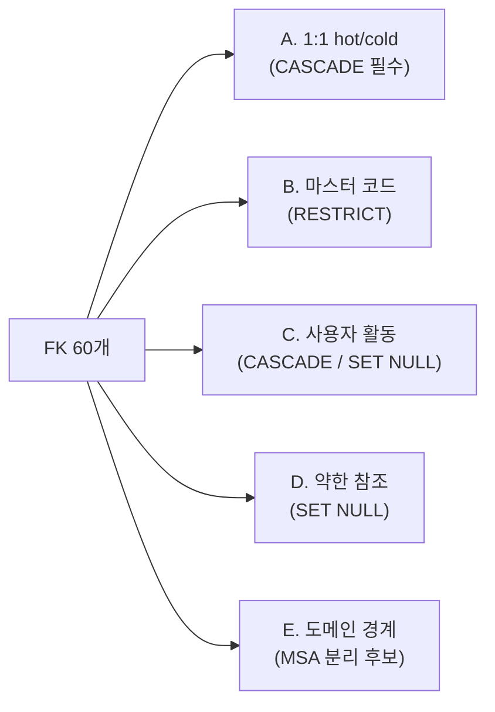
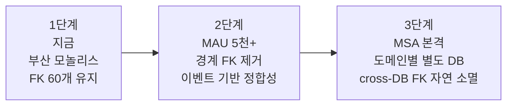

> **TL;DR**
> - 실무에서 "FK 안 건다"는 말이 흔하다. 놀러온나는 **FK 60개를 다 유지**한다
> - 그 통념은 **분산 시스템·대규모 OLTP·MSA 도메인 분리** 맥락. 우리는 **단일 RDS + 단일 모놀리스 + 부산 한정 수만 row**라 안 맞음
> - 60개 FK를 5종류로 분류해보면 4종류는 무결성에 필수, 1종류만 미래 분리 후보
> - ADR 0002에 **"지금 다 유지, MSA 분리 직전에 경계 FK만 제거"** 명문화

---

## 1. "FK 안 건다"는 어디서 나온 말인가

블로그·강연·면접 답변에서 "현업에선 FK 안 씁니다" 같은 말을 자주 본다.
틀린 말은 아닌데, **그 사람들의 맥락이 우리와 다르다.**

이 통념의 출처를 4가지로 분류해보면:

| 출처 | 맥락 | 우리에게 적용? |
|---|---|---|
| **분산 시스템 / sharding** | 다른 DB 인스턴스 간엔 FK 자체가 불가능 | ❌ 우리는 단일 RDS |
| **대규모 OLTP** | INSERT/DELETE마다 FK 검증 부하 누적 | ❌ 우리는 일 1회 sync + Spring 소규모 트래픽 |
| **MSA 도메인 경계** | 서비스 간 결합도 낮추려고 의도적 제거 | ❌ 모놀리스. MSA 분리는 1년 이후 |
| **테이블 삭제·변경 비용** | 의존성 사슬 풀어야 함 | ⚠️ 일부 맞음. §4 운영 팁 참조 |

→ **상위 3개는 우리 맥락에 안 맞음.** 4번째만 부분적으로 맞고, 그건 운영 팁으로 풀 수 있는 문제다.

---

## 2. 우리 상황 — 단일 RDS 모놀리스

| 항목 | 값 |
|---|---|
| DB | PostgreSQL 16 단일 RDS (AWS ap-northeast-2) |
| 서비스 | Python 파이프라인 + Spring Boot 백엔드, 같은 DB 공유 |
| 데이터 규모 | 부산 ~7,000 스팟, ~600 가성비 매장, MAU 목표 5,000 |
| 마이그레이션 | Alembic 단독 운영 (시리즈 #2 참조) |
| MSA 분리 계획 | 2단계(MAU 5천 도달) 이후 검토, 본격 분리는 3단계 |

**현재 단계에서 FK가 막아주는 가치 ≫ FK 유지 비용.**
빼면 운영 사고 직결, 유지하면 거의 무료.

---

## 3. FK 60개를 5종류로 분류

전수 조사해서 5가지 카테고리로 묶었다.



각 카테고리를 하나씩 본다.

### A. 1:1 hot/cold 결합 — CASCADE 필수, 빼면 고아 row 발생

```
spot_details, spot_embeddings, spots_raw_snapshots,
spot_images, spot_tags, spot_congestion_forecast → spots_core
event_details, event_embeddings, event_images   → events_core
travel_course_embeddings, courses_raw_snapshots,
course_items                                     → travel_courses
gps_raw_snapshots                                → good_price_shops
user_embeddings                                  → users
```

이 그룹은 **부모 row와 함께 살고 죽어야 한다.**
부모 스팟이 삭제됐는데 임베딩(1536차원 벡터)만 떠다니면 검색 결과에 깨진 링크가 노출된다.

```sql
spot_details.content_id
  REFERENCES spots_core(content_id) ON DELETE CASCADE
```

→ **FK 빼면 고아 row 청소 cron을 직접 짜야 한다.** 그게 한 번이라도 빠지면 데이터 정합성 깨짐.

### B. 마스터 코드 참조 — RESTRICT, 잘못된 코드 차단

```
spots_core / events_core / weather_grids /
spot_congestion_forecast                  → ldong_codes
spots_core                                 → lcls_systm_codes
spot_tags / hankkut_tags                   → tags
good_price_shops                           → good_price_locale_codes
```

TourAPI에서 받은 `lDongRegnCd`, `lclsSystm1` 같은 코드값을 INSERT 시점에 자동 검증.
**FK 빼면 오타 1개로 전체 도메인이 깨질 수 있다.**

예: 시군구 코드 `26` 대신 `260`이 박히면 지도·통계 쿼리가 모두 어긋남.
잡힌 시점에 이미 수십만 row 오염.

```sql
spots_core.l_dong_signgu_cd
  REFERENCES ldong_codes(signgu_cd) ON DELETE RESTRICT
```

### C. 사용자 활동 — CASCADE / SET NULL, GDPR / 탈퇴 처리

```
bookmarks, visit_history, notifications      → users  (CASCADE)
user_reviews                                  → users  (SET NULL, 익명화 보존)
user_embeddings, bookmark_collections         → users  (CASCADE)
```

탈퇴 처리 시 본인 데이터 자동 삭제. `USER_REVIEWS`만 공개 콘텐츠라 익명화 보존.
**FK 없으면 탈퇴 cron이 매번 manual delete 쿼리 6~7개 작성해야** 하고, 그 중 하나만 빠뜨려도 GDPR 위반.

```sql
bookmarks.user_id     REFERENCES users(id) ON DELETE CASCADE
user_reviews.user_id  REFERENCES users(id) ON DELETE SET NULL
```

→ FK가 GDPR 사고 방지의 1차 방어선.

### D. 약한 참조 — SET NULL, 본체는 보존

```
events_core.venue_spot_id          → spots_core  (행사장 매칭)
good_price_shops.matched_spot_id   → spots_core  (가성비 매칭)
course_items.matched_spot_id       → spots_core  (공식 코스 → 스팟 매칭)
generated_courses.parent_course_id → generated_courses  (재추천 부모자식)
course_decisions.replacement_spot_id → spots_core (대체 결정)
```

참조 대상이 사라져도 자기는 유지. 운영 부담 사실상 0.
**FK 유지하는 비용이 거의 없으면서 잘못된 참조는 막아준다.** 빼야 할 이유가 없음.

```sql
events_core.venue_spot_id
  REFERENCES spots_core(content_id) ON DELETE SET NULL
```

### E. 도메인 경계 FK — MSA 분리 시 제거 후보 ⭐

```
bookmarks.{spot_content_id, generated_course_id,
           event_content_id, hankkut_id}      → 마스터들
generated_course_items.spot_content_id        → spots_core
hankkut_spots / events / tags.*               → 마스터들
sync_logs.triggered_by                        → users
```

**사용자 도메인 ↔ 마스터 콘텐츠 도메인**을 가로지르는 FK.
지금은 유지, **MSA 분리 직전(2단계)에만 제거** — 그땐 이벤트 + 리컨실리에이션으로 정합성을 대체한다.

→ **이 그룹만이 미래의 제거 대상.** 나머지 4그룹(A~D)은 영구 유지.

---

## 4. "테이블 삭제 어렵다"는 정말 큰 문제인가

FK가 많아도 alembic downgrade가 정상이면 무리 없음. 진짜 문제가 되는 건 **수동 DROP 시점**.

### 안 됨

```sql
DROP TABLE spots_core;
-- ERROR: cannot drop table spots_core because other objects depend on it
-- DETAIL: constraint spot_details_content_id_fkey on table spot_details
--         depends on table spots_core (이하 6개 더)
```

### 개발/테스트 환경 — CASCADE 한 방

```sql
DROP TABLE spots_core CASCADE;
-- 의존하는 모든 FK + 테이블이 같이 사라짐
```

⚠️ **운영에선 절대 쓰지 말 것**. 의존 테이블까지 통째로 사라져 데이터 손실.

### 운영 환경 — 단계적 분리

```sql
-- 1) 의존 FK 제약을 먼저 푼다
ALTER TABLE bookmarks       DROP CONSTRAINT bookmarks_spot_content_id_fkey;
ALTER TABLE spot_details    DROP CONSTRAINT spot_details_content_id_fkey;
ALTER TABLE spot_embeddings DROP CONSTRAINT spot_embeddings_content_id_fkey;
-- ... 나머지 의존 FK 다 풀고

-- 2) 부모 DROP
DROP TABLE spots_core;
```

Alembic 마이그레이션의 `downgrade()`가 이미 이 순서대로 짜여 있다.
**즉 "테이블 삭제가 어렵다"는 통념은 마이그레이션 도구가 안 풀어주는 환경의 얘기**고, Alembic 단독 운영(시리즈 #2)에선 자동화돼 있다.

### 컬럼 타입 변경

`VARCHAR(20) → VARCHAR(40)` 같은 단순 확장은 FK 무관하게 됨.
`INT → BIGINT` 같은 호환 안 되는 변경은 FK 풀고 재부착 필요. 이건 FK 비용.

→ FK 비용 사례는 있지만 **새 컬럼 타입 변경 자체가 드문 이벤트**라 ROI 계산상 무시 가능.

---

## 5. 단계별 정책 (ADR 0002)

ADR 0002 — DDD/MSA 확장 대비 참조 정책의 결정을 그대로 따른다.



| 시점 | 액션 | 이유 |
|---|---|---|
| **1단계 (지금)** | FK 60개 다 유지 | 데이터 무결성 우선. 단일 RDS·모놀리스라 비용 ≈ 0 |
| **2단계 (MAU 5천+ 도달 후)** | E그룹 FK만 단계적 제거 + 이벤트 기반 정합성으로 전환 | 사용자/마스터 도메인 분리 시작 |
| **3단계 (MSA 본격 분리)** | 도메인별 별도 DB → cross-DB FK는 자연스럽게 불가능 | A~D그룹은 도메인 안에 묶여있어 그대로 유지 |

핵심: **"지금 미리 빼두면 나중에 편해진다"는 함정**.
지금 빼면 무결성 사고만 늘어나고, 어차피 2단계에서 다시 작업해야 한다.

---

## 6. 결론 — 통념을 따르는 게 항상 정답은 아니다

| 통념 | 실제 |
|---|---|
| "FK 안 건다" | 분산 시스템·대규모 OLTP·MSA 맥락에서의 답 |
| "현업에선 안 쓴다" | 그 사람들의 현업이 우리 현업과 다름 |
| "테이블 못 지운다" | `DROP CASCADE` 또는 단계적 분리로 해결 가능 |

우리 케이스의 결정 근거 4가지:

1. **단일 RDS + 단일 모놀리스 + 부산 한정 규모** — FK 비용 거의 0
2. **무결성 사고 비용 ≫ FK 유지 비용** — 다 거는 게 ROI 높음
3. **MSA 분리는 2단계 이후** — 지금 미리 빼두면 무결성만 약해짐
4. **ADR 0002에 단계별 진화 명문화** — 미래에 어느 FK를 제거할지 이미 결정됨

> 통념을 따르는 게 항상 정답은 아니다.
> **자기 시스템의 규모·구조·미래 단계를 보고 결정해야 한다.**
>
> "FK 안 건다"는 답은 어떤 시스템엔 진리, 어떤 시스템엔 사고의 원인이다.

---

**관련 글 (시리즈)**
- [#1 비용 통제 4단계 — 1,000콜로 7,000 스팟 적재하기](/blog/nolleoonna-quota-control/)
- [#2 Python + Spring 멀티스택에서 마이그레이션 도구 선택 — Alembic 단독](/blog/nolleoonna-migration-strategy/)
- **#3 MSA 통념 vs 모놀리스 현실 — FK 60개를 다 건 이유** (이 글)
