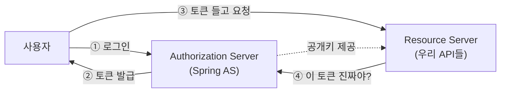
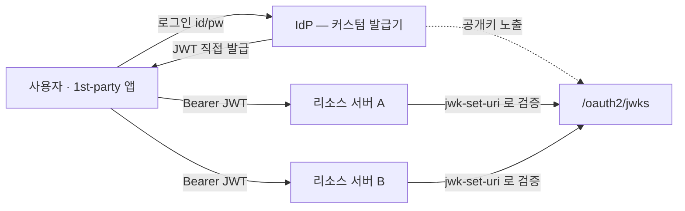

> 여러 서비스를 **하나의 계정으로 로그인**하게 묶으려고 통합 인증 서버(IdP)를 찾다 보면 꼭 만나는 이름이 **Spring Authorization Server**다. 그런데 막상 검색하면 "JWKSource 빈을 등록하고…" 같은 코드부터 튀어나온다. 이 글은 **그게 대체 뭐고, 어디에 쓰는 물건인지**부터 차근차근 본다.

---

## 0. 한 줄 정의

**Spring Authorization Server**(이하 **Spring AS**)는

> **Spring 팀이 공식 지원하는 OAuth2 / OIDC 인증·인가 서버(Authorization Server) 구현체**다.

풀어보면 이렇다.

- **OAuth2 / OIDC** — "로그인하고 토큰 받아서 다른 서비스 호출하기"의 표준 규약.
- **인증·인가 서버(Authorization Server)** — 그 규약에서 **토큰을 발급하는 쪽**. "이 사람 맞아, 이 권한 있어"를 증명하는 토큰을 찍어주는 발급소.
- **공식 지원 구현체** — 이 발급소를 직접 밑바닥부터 짜지 말고 Spring이 만들어 둔 걸 가져다 쓰라는 것.

즉 Spring AS는 **"우리 회사 전용 로그인 서버(IdP)"를 만들 때 쓰는 토큰 발급 엔진**이다. 카카오·구글 로그인에서 우리가 *받는* 쪽이었다면, Spring AS는 우리가 *발급하는* 쪽이 되게 해준다.

> 💡 **IdP**(Identity Provider, 신원 공급자) = "이 사람이 누구인지"를 책임지고 증명해주는 주체. 카카오 로그인의 카카오, 구글 로그인의 구글이 IdP다. 사내 서비스가 여러 개일 때 **우리만의 IdP**를 두면, 직원/사용자가 계정 하나로 모든 서비스에 로그인할 수 있다.

---

## 1. 왜 직접 만들지? — 헷갈리는 부품들

OAuth2 세계엔 엄밀히는 등장인물이 **넷**이다(`Resource Owner`·`Authorization Server`·`Resource Server`·`Client`). 이 중 Spring으로 직접 구현하는 건 가운데 셋이고, **Resource Owner(자원 주인 = 로그인하는 사용자 본인)**는 사람이라 코드로 만드는 게 아니다. 이 배치를 못 잡으면 Spring AS가 어디 앉는지 영영 안 잡힌다.

| 부품 | 역할 | 비유 | Spring에서 |
|---|---|---|---|
| **Resource Owner** | 자기 자원의 주인 = **로그인하는 사용자** | 여권 주인(본인) | 사람 (코드 아님) |
| **Authorization Server** | 로그인 받고 **토큰 발급** | 여권 발급소 | **Spring Authorization Server** |
| **Resource Server** | 토큰 검증하고 **API 제공** | 출입국 심사대 | `spring-boot-starter-oauth2-resource-server` |
| **Client** | 사용자 대신 토큰 들고 다님 | 여권 들고 다니는 여행자 | 웹/앱, `oauth2-client` |



지금까지 카카오·구글 로그인을 붙였다면 우리 서비스는 **Client**(③번 토큰 들고 다니는 쪽)였다. 그런데 **서비스가 여러 개**가 되면 이야기가 달라진다.

- 수리 서비스, 중고거래, 웹툰… 각각 따로 로그인을 만들면 사용자는 계정을 세 번 만든다.
- 서비스 A가 서비스 B의 API를 호출할 때 신원을 어떻게 증명하지?

그래서 **①②번을 책임지는 우리만의 발급소(AS)**가 필요해지고, 그 발급소를 직접 짜는 대신 검증된 구현을 쓰는 게 **Spring AS**다.

---

## 2. Spring AS가 대신 해주는 것들

Spring AS를 의존성에 추가하고 빈 몇 개만 등록하면, 아래 같은 **대표 엔드포인트**가 자동으로 생긴다. 직접 짜면 각각이 며칠짜리 작업이다.

| 엔드포인트 | 하는 일 |
|---|---|
| `/oauth2/authorize` | 인가 요청 (로그인·동의 시작점) |
| `/oauth2/token` | 토큰 발급/갱신 |
| `/oauth2/jwks` | **공개키 공개** (리소스 서버가 서명 검증할 때 가져감) |
| `/oauth2/introspect` | 토큰이 유효한지 묻기 |
| `/oauth2/revoke` | 토큰 무효화 (caveat는 아래) |
| `/.well-known/oauth-authorization-server` | OAuth 서버 메타데이터 |

> 이게 전부가 아니다. 기본 설정에 디바이스 코드 엔드포인트도 있고, **`.oidc()`를 켜야** OIDC 관련 엔드포인트(`/.well-known/openid-configuration`, `/userinfo`, 동적 클라이언트 등록 등)가 추가로 붙는다. 위는 가장 자주 보는 것만 추린 거다.

> ⚠️ **`/oauth2/revoke`의 함정**: 리소스 서버가 JWKS로 토큰을 **로컬 검증**하면, AS에서 revoke를 호출해도 **이미 발급된 access token은 만료(`exp`) 전까지 그대로 통과**한다. "무효화 엔드포인트가 있다"와 "모든 요청에서 즉시 차단된다"는 다르다. 즉시 차단이 필요하면 **짧은 access TTL + introspection(매 요청 AS에 확인) 또는 denylist**가 함께 있어야 한다.

여기서 처음 보면 낯선 두 단어만 짚고 가자.

### JWKS — "내 공개키 명함"

토큰(JWT)은 AS의 **개인키로 서명**된다. 리소스 서버는 그게 진짜 우리 AS가 발급한 토큰인지 **공개키로 검증**한다. 그 공개키를 모아 JSON으로 노출하는 게 `/oauth2/jwks`다. 리소스 서버는 이 URL만 알면 "이 토큰 우리 AS가 찍은 거 맞네" 하고 스스로 검증한다 — AS에 매번 물어볼 필요 없이.

### issuer — "발급처 도장"

`issuer`는 토큰에 찍히는 **"누가 발급했는가"** 값(`iss` 클레임). `https://auth.our-service.com` 같은 식이다. 리소스 서버는 토큰의 `iss`가 자기가 신뢰하는 발급처와 같은지 확인한다(Spring Security에선 `issuer-uri` 설정이 이 `iss` 검증을 켠다).

> 실전 팁: `iss`만 보면 "우리 IdP가 발급한 토큰"까지만 보장된다. **"이 토큰이 *나(이 리소스 서버)*에게 쓰라고 발급된 게 맞는가"**까지 막으려면 `aud`(audience) 검증을 더한다. Spring Security에선 `audiences`를 따로 설정해 `aud` 클레임을 검사한다 — A 서비스용 토큰이 B 서비스에 그대로 먹히는 걸 막는 한 줄이다.

---

## 3. 최소 설정 — "어디까지가 최소"인지부터 구분하자

"빈 4개면 끝"이라는 말을 자주 보는데, **그 4개로 도달하는 지점이 어디까지인지**를 정확히 알아야 한다. 흔히 말하는 핵심 빈은 이거다.

```java
@Configuration
public class AuthorizationServerConfig {

    // ① OAuth2/OIDC 엔드포인트를 활성화하는 AS 전용 필터체인
    @Bean @Order(1)
    public SecurityFilterChain authServerChain(HttpSecurity http) throws Exception {
        OAuth2AuthorizationServerConfigurer as =
            OAuth2AuthorizationServerConfigurer.authorizationServer();
        http.securityMatcher(as.getEndpointsMatcher())
            .with(as, server -> server.oidc(Customizer.withDefaults())) // OIDC 켜기
            .authorizeHttpRequests(a -> a.anyRequest().authenticated())
            // ★ 미인증 사용자가 /oauth2/authorize 에 오면 로그인 폼으로 리다이렉트
            .exceptionHandling(e -> e.authenticationEntryPoint(
                new LoginUrlAuthenticationEntryPoint("/login")));
        return http.build();
    }

    // ② 서명 키 (공개키는 /oauth2/jwks 로 자동 노출)
    @Bean
    public JWKSource<SecurityContext> jwkSource(RSAKey rsaKey) {
        return new ImmutableJWKSet<>(new JWKSet(rsaKey));
    }

    // ③ issuer 등 서버 설정
    @Bean
    public AuthorizationServerSettings authorizationServerSettings(
            @Value("${app.issuer}") String issuer) {
        return AuthorizationServerSettings.builder().issuer(issuer).build();
    }

    // ④ 토큰을 받아갈 클라이언트 등록부
    @Bean
    public RegisteredClientRepository registeredClientRepository() {
        /* InMemory 또는 JDBC */
    }
}
```

- **①** OAuth2/OIDC 엔드포인트를 켜는 AS 전용 필터체인. `securityMatcher`로 OAuth 경로만 잡는다.
- **②** 서명 키. 여기서 나오는 공개키가 자동으로 `/oauth2/jwks`에 실린다.
- **③** `issuer` 설정. 위에서 본 "발급처 도장".
- **④** `RegisteredClient` = "이 토큰을 받아갈 자격이 있는 앱"의 등록부. grant type·스코프를 정의한다.

이 4개로 도달하는 지점은 **`GET /oauth2/jwks`가 응답하고, 기계 대 기계(`client_credentials`) 토큰 발급이 도는 것**까지다. 첫 마일스톤으로는 충분하다.

> `RegisteredClient`가 헷갈릴 수 있다. 사용자 계정이 아니라 **앱(클라이언트) 등록**이다. "내 모바일 앱", "파트너사 연동", "서비스 A→B 호출" 각각을 클라이언트로 등록한다고 생각하면 된다.

### 브라우저로 로그인하는 흐름(authorization_code/OIDC)은 4개로 부족하다

`authorization_code` flow는 **자원 주인(사용자)을 실제로 인증하는 메커니즘이 별도로** 있어야 한다([공식 문서가 명시](https://docs.spring.io/spring-authorization-server/reference/getting-started.html)하는 요구사항이다). AS 체인은 "엔드포인트 배관"일 뿐, **"사용자 로그인 화면과 검증"은 따로 준다.** 그래서 위 4개에 더해 보통 이만큼이 더 붙는다.

| 추가로 필요한 것 | 왜 |
|---|---|
| **기본(앱) `SecurityFilterChain`** (`@Order(2)`) + `formLogin()` 또는 `oauth2Login()` | AS 체인이 안 잡는 `/login` 등 일반 요청을 받고 **로그인 폼을 띄울** 체인 |
| **`UserDetailsService`** (또는 다른 사용자 인증 수단) | "이 사용자가 누구이고 비밀번호가 맞는가"를 검증할 주체 |
| AS 체인의 **`LoginUrlAuthenticationEntryPoint`** | 미인증 상태로 `/oauth2/authorize`에 오면 로그인 폼으로 돌려보냄(위 코드 ★) |
| **`JwtDecoder`** | OIDC와 AS 내부 검증 경로에서 발급된 JWT를 다시 검증 |

> 정리하면, **"AS 엔드포인트가 살아있다"**(빈 4개)와 **"사람이 브라우저로 로그인해서 인가 코드를 받는다"**(+ 사용자 인증 체인)는 다른 단계다. 후자를 건너뛰면 `/oauth2/authorize`를 열어도 로그인할 화면이 없다.

> 💡 **"소셜 로그인(구글·카카오)"은 Spring AS가 자동으로 해주는 기능이 아니다.** 그건 **우리 IdP가 거꾸로 외부 IdP의 Client가 되는** 구성으로, `spring-boot-starter-oauth2-client` + `oauth2Login()`을 위 앱 체인에 붙여 **"사용자를 인증하는 한 수단"**으로 끼우는 것이다. 즉 `formLogin`(자체 비번)과 `oauth2Login`(소셜)은 둘 다 *Resource Owner를 인증하는 입구*이고, 그 인증이 끝나야 AS가 인가 코드를 발급한다.

---

## 4. 로그인 흐름 선택 — 기본은 표준, 커스텀은 트레이드오프를 알고

여기까지가 "Spring AS란 무엇인가"다. 실전에선 **사용자 로그인을 어떻게 받을지**를 고른다. 결론부터 말하면 **기본 권장은 표준 흐름**이고, 커스텀 직접 발급은 대가를 알고 쓰는 선택지다.

### 기본 권장 — authorization_code + PKCE, 또는 BFF

- **SPA·모바일 같은 public client** → `authorization_code` + **PKCE**. 비밀을 안전히 못 숨기는 클라이언트의 표준이다.
- **브라우저 웹앱** → 토큰을 브라우저 JS에 두지 않는 **BFF(Backend-for-Frontend)** 패턴이 더 안전하다. 토큰은 서버가 쥐고, 브라우저엔 세션 쿠키만.

> ⚠️ "REST API로 id/pw 보내서 access token을 JSON으로 받는다"는, 흔하긴 해도 **OAuth2가 의도한 방식이 아니다**(Spring 문서도 이 기대를 명시적으로 정정한다). 리다이렉트가 번거로워 보여도, public client라면 `authorization_code` + PKCE가 표준이자 더 안전한 길이다.

### 가능한 선택지 — 1st-party 한정 커스텀 직접 발급

순수 사내용 1st-party 환경이라면, 회원 DB로 직접 인증하고 JWT를 직접 발급하는 구성을 **선택할 수는 있다.** 단, 이건 **표준 OAuth/OIDC 발급 흐름을 상당 부분 벗어나는** 결정이라 트레이드오프가 따른다.



여기서 **반드시 짚을 경계**: 이 그림에서 Spring AS는 사실상 **JWKS 노출과 (별도로 구성한) `client_credentials`만** 담당한다. 커스텀 발급기가 직접 찍은 토큰은 **AS가 발급 사실조차 모른다.** 그래서

> **커스텀 발급 토큰엔 AS의 토큰 관리가 적용되지 않는다.** `/oauth2/introspect`·`/oauth2/revoke`·refresh 추적은 **AS가 발급한 토큰 한정**이다. 커스텀 토큰을 `/oauth2/revoke`에 넣어도 먹지 않는다 — 무효화·회전·재사용 탐지를 **내가 직접** 짜야 한다.

커스텀 발급을 **표준 흐름 안에 넣고** 싶다면, 토큰을 밖에서 찍지 말고 **Token Endpoint에 extension grant를 붙이고 발급 결과를 `OAuth2AuthorizationService.save(...)`로 등록**하는 게 정석이다. 이러면 introspection·revocation이 그대로 적용된다(공식 가이드가 이 패턴을 보여준다).

핵심은 **"AS의 배관(JWKS·issuer·client)"과 "누가 로그인하는가(도메인)"를 분리**하되, **"AS가 관리하는 토큰"과 "내가 직접 찍은 토큰"의 경계를 흐리지 않는 것**이다.

---

## 5. 데모 코드가 운영에서 터지는 지점들

튜토리얼을 그대로 따라가면 로컬에선 완벽히 도는데, **운영에 올리는 순간 조용히 터지는** 곳이 있다. 입문 단계에선 "이런 게 있구나"만 알아도 충분하다.

### ① 부팅마다 서명 키를 새로 만든다 (제일 흔함)

공식 샘플이 이렇게 시작한다.

```java
// ❌ 데모 코드 — 운영에 그대로 쓰면 안 됨
private RSAKey generateRsaKey() {
    KeyPair kp = KeyPairGenerator.getInstance("RSA")...generateKeyPair();
    return new RSAKey.Builder((RSAPublicKey) kp.getPublic())
            .privateKey(kp.getPrivate())
            .keyID(UUID.randomUUID().toString())   // 매 부팅 랜덤 kid
            .build();
}
```

애플리케이션이 뜰 때마다 새 키를 만든다. 그 결과:

| 상황 | 결과 |
|---|---|
| 재시작 / 재배포 | 키가 바뀜 → 직전 토큰 전부 검증 실패 = **전 사용자 강제 로그아웃** |
| 다중 인스턴스 | 인스턴스마다 키가 달라 → 로드밸런서 뒤에서 **랜덤 401** |

**고치는 법**: 키쌍을 키스토어(`.p12`)나 KMS/Vault에 **영속화**해서 모든 재시작·모든 인스턴스가 같은 키를 쓰게 한다. `kid`(키 ID)는 "고정"이 아니라 **키 material마다 안정적으로 유일**하게 둔다 — 같은 키면 재시작·다중 인스턴스에서 항상 같은 `kid`, 키를 바꾸면 새 `kid`.

```bash
keytool -genkeypair -alias idp-jwt -keyalg RSA -keysize 2048 \
  -storetype PKCS12 -keystore idp-jwt.p12 -storepass <6자이상> -validity 3650
```

> `*.p12`(사설키)는 **절대 커밋하지 않는다.**

> 🔁 **키 회전**: 새 키에 **옛 `kid`를 재사용하면** 캐시된 JWKS·검증 로직이 꼬인다(같은 `kid`인데 키가 달라짐). 그래서 키 material이 바뀌면 **새 `kid`를 부여**하고, 전환 기간엔 **old+new 키를 JWKS에 함께 노출**해 옛 토큰도 만료까지 검증되게 한다. 새 키로만 *서명*하고, *검증*은 둘 다 받아주는 식이다.

### ② issuer 삼위일체

이게 "토큰은 멀쩡한데 401" 1순위 원인이다. 세 군데가 **글자 하나까지** 같아야 검증을 통과한다.

```text
app.issuer  =  AuthorizationServerSettings.issuer  =  리소스서버의 issuer-uri
```

### ③ AS 체인 따로 두면 앱 체인도 정의

AS 필터체인(`@Order(1)`)은 `securityMatcher`로 OAuth 경로만 잡는다. 나머지 일반 요청을 받을 **앱 기본 체인(`@Order(2)`)**이 없으면 컨텍스트가 불완전해진다.

```java
@Bean @Order(2)
SecurityFilterChain appChain(HttpSecurity http) throws Exception {
    http.authorizeHttpRequests(a -> a
        .requestMatchers("/.well-known/**", "/oauth2/jwks").permitAll()
        .anyRequest().authenticated());
    return http.build();
}
```

> ⚠️ 소셜 로그인·`authorization_code`·동의(consent) 화면처럼 **브라우저로 상호작용하는 흐름은 세션이 필요**하다. 앱 체인을 완전 `STATELESS`로 두면 그 흐름이 깨진다. 커스텀 로그인만 쓰고 서비스간 호출이 `client_credentials`면 무상태로 충분하다.

### ④ 커스텀 발급을 택했다면 — 무효화를 직접 소유

**4번**에서 봤듯 커스텀 발급 토큰엔 AS의 introspection·revocation·refresh 추적이 안 먹는다. 그러니 직접 발급을 택했다면 **이 기능들을 내가 짜야** 한다.

- **계정 존재 숨김**: 로그인 실패는 "이메일 없음/비번 틀림" 구분 없이 단일 메시지로. 미존재 계정도 **동일한 BCrypt 비용**을 소비해 타이밍 사이드채널을 막는다.
- **Refresh 로테이션 + 재사용 탐지**: refresh는 회전시키고 **해시로 저장**. 옛 토큰이 재등장하면 **세션 전체 폐기**.
- **즉시 무효화가 필요하면**: JWT 로컬 검증 특성상 revoke가 즉시 안 먹으므로(2번 caveat), **짧은 access TTL + denylist** 또는 introspection 기반 검증을 함께 둔다.

### ⑤ DB 경계는 dev에서도 살려둬라

dev에서 한 DB에 모아 쓰더라도 **코드는 DB가 항상 떨어져 있다고 가정**하고 짜야 한다.

- **IdP는 자기 전용 DB만 본다.** 다른 서비스 DB로 cross-read 금지.
- **IdP는 신원만 소유.** 포인트·주문 같은 앱 데이터를 인증 테이블에 두지 않는다.
- **서비스는 auth DB를 영원히 안 본다.** 식별은 JWT 클레임, 저장은 `accountId`를 값으로만(FK 아님).
- **스키마 진실은 Flyway.** 운영에서 `ddl-auto`는 금물.

---

## 정리

- **Spring AS = Spring 공식 OAuth2/OIDC 인증 서버.** "우리만의 로그인 서버(IdP)"를 만들 때 토큰 발급 엔진으로 쓴다.
- OAuth2 네 역할 중 **Authorization Server**(토큰 발급) 자리에 앉는다(Resource Owner = 사용자 본인).
- 빈 4개로는 **JWKS 응답 + `client_credentials`**까지다. **브라우저 로그인(authorization_code/OIDC)**은 사용자 인증 체인(`formLogin`/`oauth2Login` + `UserDetailsService` + `LoginUrlAuthenticationEntryPoint` + `JwtDecoder`)이 더 필요하다.
- 로그인 흐름 **기본 권장은 표준**(public client는 `authorization_code` + PKCE, 웹은 BFF). 커스텀 직접 발급은 1st-party 한정 선택지이며, 그 토큰엔 **AS의 introspection·revocation·refresh 추적이 안 먹는다.**
- 운영 함정: **서명 키 영속화(+`kid` 안정적 유일·회전)·issuer 일치·`aud` 검증·revoke의 JWT caveat·DB 경계.**

> 튜토리얼 코드는 "돌아가는 것"을 보여주고, 운영은 "**재시작·확장·경계에서도 돌아가는 것**"을 요구한다.
