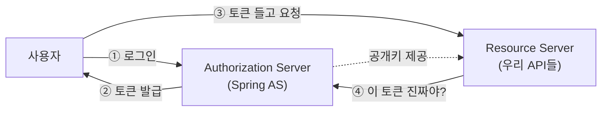
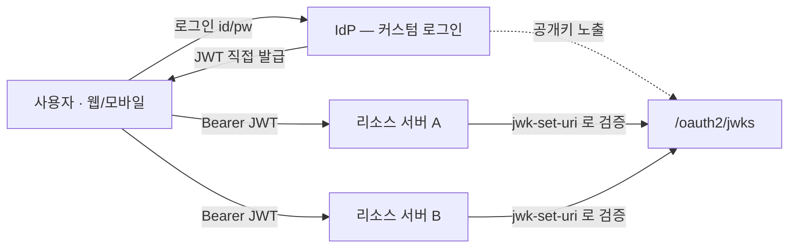

> 여러 서비스를 **하나의 계정으로 로그인**하게 묶으려고 통합 인증 서버(IdP)를 찾다 보면 꼭 만나는 이름이 **Spring Authorization Server**다. 그런데 막상 검색하면 "JWKSource 빈을 등록하고…" 같은 코드부터 튀어나온다. 이 글은 **그게 대체 뭐고, 어디에 쓰는 물건인지**부터 차근차근 본다.

---

## 0. 한 줄 정의

**Spring Authorization Server**(이하 **Spring AS**)는

> **Spring 팀이 공식 지원하는 OAuth2 / OIDC 인증·인가 서버(Authorization Server) 구현체**다.

풀어보면 이렇다.

- **OAuth2 / OIDC** — "로그인하고 토큰 받아서 다른 서비스 호출하기"의 표준 규약.
- **인증·인가 서버(Authorization Server)** — 그 규약에서 **토큰을 발급하는 쪽**. "이 사람 맞아, 이 권한 있어"를 증명하는 토큰을 찍어주는 발급소.
- **공식 지원 구현체** — 이 발급소를 직접 밑바닥부터 짜지 말고 Spring이 만들어 둔 걸 가져다 쓰라는 것.

즉 Spring AS는 **"우리 회사 전용 로그인 서버(IdP)"를 만들 때 쓰는 토큰 발급 엔진**이다. 카카오·구글 로그인에서 우리가 *받는* 쪽이었다면, Spring AS는 우리가 *발급하는* 쪽이 되게 해준다.

> 💡 **IdP**(Identity Provider, 신원 공급자) = "이 사람이 누구인지"를 책임지고 증명해주는 주체. 카카오 로그인의 카카오, 구글 로그인의 구글이 IdP다. 사내 서비스가 여러 개일 때 **우리만의 IdP**를 두면, 직원/사용자가 계정 하나로 모든 서비스에 로그인할 수 있다.

---

## 1. 왜 직접 만들지? — 헷갈리는 세 부품

OAuth2 세계엔 등장인물이 셋이다. 이걸 구분 못 하면 Spring AS가 어디 앉는지 영영 안 잡힌다.

| 부품 | 역할 | 비유 | Spring에서 |
|---|---|---|---|
| **Authorization Server** | 로그인 받고 **토큰 발급** | 여권 발급소 | **Spring Authorization Server** |
| **Resource Server** | 토큰 검증하고 **API 제공** | 출입국 심사대 | `spring-boot-starter-oauth2-resource-server` |
| **Client** | 사용자 대신 토큰 들고 다님 | 여권 들고 다니는 여행자 | 웹/앱, `oauth2-client` |



지금까지 카카오·구글 로그인을 붙였다면 우리 서비스는 **Client**(③번 토큰 들고 다니는 쪽)였다. 그런데 **서비스가 여러 개**가 되면 이야기가 달라진다.

- 수리 서비스, 중고거래, 웹툰… 각각 따로 로그인을 만들면 사용자는 계정을 세 번 만든다.
- 서비스 A가 서비스 B의 API를 호출할 때 신원을 어떻게 증명하지?

그래서 **①②번을 책임지는 우리만의 발급소(AS)**가 필요해지고, 그 발급소를 직접 짜는 대신 검증된 구현을 쓰는 게 **Spring AS**다.

---

## 2. Spring AS가 대신 해주는 것들

Spring AS를 의존성에 추가하고 빈 몇 개만 등록하면, 아래 **표준 엔드포인트**가 자동으로 생긴다. 직접 짜면 각각이 며칠짜리 작업이다.

| 엔드포인트 | 하는 일 |
|---|---|
| `/oauth2/authorize` | 인가 요청 (로그인·동의 시작점) |
| `/oauth2/token` | 토큰 발급/갱신 |
| `/oauth2/jwks` | **공개키 공개** (리소스 서버가 서명 검증할 때 가져감) |
| `/oauth2/introspect` | 토큰이 유효한지 묻기 |
| `/oauth2/revoke` | 토큰 무효화 |
| `/.well-known/openid-configuration` | "내 엔드포인트 목록은 여기야" 안내문 |

여기서 처음 보면 낯선 두 단어만 짚고 가자.

### JWKS — "내 공개키 명함"

토큰(JWT)은 AS의 **개인키로 서명**된다. 리소스 서버는 그게 진짜 우리 AS가 발급한 토큰인지 **공개키로 검증**한다. 그 공개키를 모아 JSON으로 노출하는 게 `/oauth2/jwks`다. 리소스 서버는 이 URL만 알면 "이 토큰 우리 AS가 찍은 거 맞네" 하고 스스로 검증한다 — AS에 매번 물어볼 필요 없이.

### issuer — "발급처 도장"

`issuer`는 토큰에 찍히는 **"누가 발급했는가"** 값(`iss` 클레임). `https://auth.our-service.com` 같은 식이다. 리소스 서버는 토큰의 `iss`가 자기가 신뢰하는 발급처와 같은지도 확인한다.

---

## 3. 최소 설정 — 빈 4개

Spring AS를 띄우는 데 꼭 필요한 빈은 사실 4개뿐이다. 이게 전부다.

```java
@Configuration
public class AuthorizationServerConfig {

    // ① OAuth2 엔드포인트들을 활성화하는 필터체인
    @Bean @Order(1)
    public SecurityFilterChain authServerChain(HttpSecurity http) throws Exception {
        OAuth2AuthorizationServerConfigurer as =
            OAuth2AuthorizationServerConfigurer.authorizationServer();
        http.securityMatcher(as.getEndpointsMatcher())
            .with(as, server -> server.oidc(Customizer.withDefaults())) // OIDC 켜기
            .authorizeHttpRequests(a -> a.anyRequest().authenticated());
        return http.build();
    }

    // ② 토큰 서명에 쓸 키 (공개키는 /oauth2/jwks 로 자동 노출)
    @Bean
    public JWKSource<SecurityContext> jwkSource(RSAKey rsaKey) {
        return new ImmutableJWKSet<>(new JWKSet(rsaKey));
    }

    // ③ 발급처(issuer) 등 서버 설정
    @Bean
    public AuthorizationServerSettings authorizationServerSettings(
            @Value("${app.issuer}") String issuer) {
        return AuthorizationServerSettings.builder().issuer(issuer).build();
    }

    // ④ 토큰을 받아갈 클라이언트 등록 (소셜 flow·서비스간 호출용)
    @Bean
    public RegisteredClientRepository registeredClientRepository() {
        /* InMemory 또는 JDBC */
    }
}
```

- **①** OAuth2/OIDC 엔드포인트를 켜는 필터체인. `securityMatcher`로 OAuth 경로만 잡는다.
- **②** 서명 키. 여기서 나오는 공개키가 자동으로 `/oauth2/jwks`에 실린다.
- **③** `issuer` 설정. 위에서 본 "발급처 도장".
- **④** `RegisteredClient` = "이 토큰을 받아갈 자격이 있는 앱"의 등록부. 어떤 grant type을 허용할지, 스코프는 뭔지 정의한다.

여기까지 하고 `bootRun` → `GET /oauth2/jwks`에 응답이 나오면 성공이다. **첫 마일스톤.**

> `RegisteredClient`가 헷갈릴 수 있다. 사용자 계정이 아니라 **앱(클라이언트) 등록**이다. "내 모바일 앱", "파트너사 연동", "서비스 A→B 호출" 각각을 클라이언트로 등록한다고 생각하면 된다.

---

## 4. 실제로 만들 땐 — 하이브리드 구조 한 줄

여기까지가 "Spring AS란 무엇인가"다. 실전에선 한 가지 선택이 더 있다: **로그인을 표준 OAuth flow로 받을지, 커스텀으로 받을지.**

표준 `authorization_code` flow는 외부 연동·서드파티엔 필수지만, **자사 앱 로그인**까지 굳이 그 리다이렉트 춤을 출 필요는 없다. 그래서 흔한 선택이 **하이브리드**다.



- **자사 로그인**: 회원 DB + 비밀번호 검증 → JWT 직접 발급 (커스텀)
- **Spring AS의 역할**: JWKS 노출·소셜 로그인·서비스간 호출(`client_credentials`)
- **리소스 서버들**: IdP의 JWKS로만 서명 검증

핵심은 **"AS의 배관(JWKS·issuer·client)"과 "누가 로그인하는가(도메인)"를 분리**하는 것. 토큰 발급소는 Spring AS에 맡기고, "누가 우리 회원인가"는 우리 도메인이 소유한다.

---

## 5. 데모 코드가 운영에서 터지는 지점들

튜토리얼을 그대로 따라가면 로컬에선 완벽히 도는데, **운영에 올리는 순간 조용히 터지는** 곳이 있다. 입문 단계에선 "이런 게 있구나"만 알아도 충분하다.

### ① 부팅마다 서명 키를 새로 만든다 (제일 흔함)

공식 샘플이 이렇게 시작한다.

```java
// ❌ 데모 코드 — 운영에 그대로 쓰면 안 됨
private RSAKey generateRsaKey() {
    KeyPair kp = KeyPairGenerator.getInstance("RSA")...generateKeyPair();
    return new RSAKey.Builder((RSAPublicKey) kp.getPublic())
            .privateKey(kp.getPrivate())
            .keyID(UUID.randomUUID().toString())   // 매 부팅 랜덤 kid
            .build();
}
```

애플리케이션이 뜰 때마다 새 키를 만든다. 그 결과:

| 상황 | 결과 |
|---|---|
| 재시작 / 재배포 | 키가 바뀜 → 직전 토큰 전부 검증 실패 = **전 사용자 강제 로그아웃** |
| 다중 인스턴스 | 인스턴스마다 키가 달라 → 로드밸런서 뒤에서 **랜덤 401** |

**고치는 법**: 키쌍을 키스토어(`.p12`)나 KMS/Vault에 **영속화**해서 모든 재시작·모든 인스턴스가 같은 키를 쓰게 한다. 그리고 `kid`(키 ID)를 고정한다.

```bash
keytool -genkeypair -alias idp-jwt -keyalg RSA -keysize 2048 \
  -storetype PKCS12 -keystore idp-jwt.p12 -storepass <6자이상> -validity 3650
```

> `*.p12`(사설키)는 **절대 커밋하지 않는다.**

### ② issuer 삼위일체

이게 "토큰은 멀쩡한데 401" 1순위 원인이다. 세 군데가 **글자 하나까지** 같아야 검증을 통과한다.

```text
app.issuer  =  AuthorizationServerSettings.issuer  =  리소스서버의 issuer-uri
```

### ③ AS 체인 따로 두면 앱 체인도 정의

AS 필터체인(`@Order(1)`)은 `securityMatcher`로 OAuth 경로만 잡는다. 나머지 일반 요청을 받을 **앱 기본 체인(`@Order(2)`)**이 없으면 컨텍스트가 불완전해진다.

```java
@Bean @Order(2)
SecurityFilterChain appChain(HttpSecurity http) throws Exception {
    http.authorizeHttpRequests(a -> a
        .requestMatchers("/.well-known/**", "/oauth2/jwks").permitAll()
        .anyRequest().authenticated());
    return http.build();
}
```

> ⚠️ 소셜 로그인·`authorization_code`·동의(consent) 화면처럼 **브라우저로 상호작용하는 흐름은 세션이 필요**하다. 앱 체인을 완전 `STATELESS`로 두면 그 흐름이 깨진다. 커스텀 로그인만 쓰고 서비스간 호출이 `client_credentials`면 무상태로 충분하다.

### ④ 커스텀 발급은 무효화를 직접 소유

토큰을 AS 밖(커스텀 Provider)에서 발급하면, AS의 토큰 관리 기능(introspection·revocation, refresh 추적)이 **그 토큰엔 적용되지 않는다.** 즉 무효화·회전·재사용 탐지를 직접 짜야 한다.

- **계정 존재 숨김**: 로그인 실패는 "이메일 없음/비번 틀림" 구분 없이 단일 메시지로. 미존재 계정도 **동일한 BCrypt 비용**을 소비해 타이밍 사이드채널을 막는다.
- **Refresh 로테이션 + 재사용 탐지**: refresh는 회전시키고 **해시로 저장**. 옛 토큰이 재등장하면 **세션 전체 폐기**.

### ⑤ DB 경계는 dev에서도 살려둬라

dev에서 한 DB에 모아 쓰더라도 **코드는 DB가 항상 떨어져 있다고 가정**하고 짜야 한다.

- **IdP는 자기 전용 DB만 본다.** 다른 서비스 DB로 cross-read 금지.
- **IdP는 신원만 소유.** 포인트·주문 같은 앱 데이터를 인증 테이블에 두지 않는다.
- **서비스는 auth DB를 영원히 안 본다.** 식별은 JWT 클레임, 저장은 `accountId`를 값으로만(FK 아님).
- **스키마 진실은 Flyway.** 운영에서 `ddl-auto`는 금물.

---

## 정리

- **Spring AS = Spring 공식 OAuth2/OIDC 인증 서버.** "우리만의 로그인 서버(IdP)"를 만들 때 토큰 발급 엔진으로 쓴다.
- OAuth2 세 부품 중 **Authorization Server**(토큰 발급) 자리에 앉는다.
- 빈 4개(필터체인·JWKSource·Settings·RegisteredClient)면 표준 엔드포인트가 자동으로 생긴다.
- 실전에선 자사 로그인은 커스텀, AS는 JWKS·소셜·서비스간 호출만 맡는 **하이브리드**가 흔하다.
- 데모 코드는 **서명 키 영속화·issuer 일치·DB 경계**만 안 고치면 운영에서 조용히 터진다.

> 튜토리얼 코드는 "돌아가는 것"을 보여주고, 운영은 "**재시작·확장·경계에서도 돌아가는 것**"을 요구한다.
