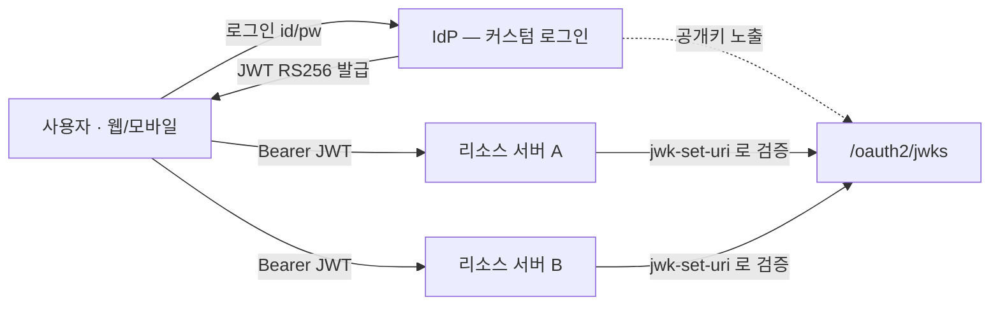

여러 서비스를 하나의 계정으로 묶는 **통합 인증 서버(IdP)** 를 Spring Authorization Server(이하 AS)로 직접 만들었다. 튜토리얼을 그대로 따라가면 로컬에선 완벽하게 도는데, **운영에 올리는 순간 조용히 터지는** 지점이 몇 군데 있다. 이 글은 그 함정들과, 데모 코드를 프로덕션용으로 바꾸는 최소 수정만 정리한다.

> **결론부터**: AS의 배관(JWKS·issuer·client·refresh)은 튜토리얼대로 가도 되지만, **키 관리·로그인 흐름·DB 경계**는 데모 코드를 그대로 쓰면 안 된다.

내가 택한 구조는 **하이브리드**다. 첫 자사 로그인은 커스텀(회원 DB + 비밀번호 검증 → RS256 JWT 직접 발급)으로 가고, AS는 JWKS 노출·소셜·서비스간 호출만 맡는다. 리소스 서버들은 IdP의 JWKS로만 서명을 검증한다.



## 1. 가장 흔한 실수: 부팅마다 서명 키를 새로 만든다

공식 샘플과 대부분의 블로그가 이렇게 시작한다.

```java
// ❌ 데모 코드 — 운영에 그대로 쓰면 안 됨
private RSAKey generateRsaKey() {
    KeyPairGenerator g = KeyPairGenerator.getInstance("RSA");
    g.initialize(2048);
    KeyPair kp = g.generateKeyPair();
    return new RSAKey.Builder((RSAPublicKey) kp.getPublic())
            .privateKey(kp.getPrivate())
            .keyID(UUID.randomUUID().toString())   // 매 부팅 랜덤 kid
            .build();
}
```

`generateRsaKey()`는 애플리케이션이 뜰 때마다 새 키쌍을 메모리에 만든다. 데모에선 문제없다. 하지만 운영에선:

| 상황 | 결과 |
|---|---|
| 재시작 / 재배포 | 키가 바뀜 → 직전에 발급된 모든 액세스·리프레시 토큰이 서명 검증 실패 = **전 사용자 강제 로그아웃** |
| 다중 인스턴스(scale-out) | 인스턴스마다 키가 달라 → A가 발급한 토큰을 B가 검증 못 함. 로드밸런서 뒤에서 **랜덤 401** |
| 키 회전 | 통제 불가 |

단일 인스턴스 dev에선 "재시작하면 로그아웃되네?" 정도라 눈에 잘 안 띈다. 그래서 그대로 운영에 올라가고, 롤링 배포 첫날 장애가 난다.


### 고치는 법 — 키를 외부에 영속화

키쌍을 키스토어(`.p12`)에서 로드해서, **모든 재시작·모든 인스턴스가 같은 키**를 쓰게 한다.

```java
@Configuration
public class JwtKeyConfig {
    private final ResourceLoader resourceLoader;
    private final String keyStoreLocation;
    private final String keyStorePassword;
    private final String keyAlias;

    public JwtKeyConfig(ResourceLoader resourceLoader,
                        @Value("${app.security.rsa.key-store}") String keyStoreLocation,
                        @Value("${app.security.rsa.key-store-password}") String keyStorePassword,
                        @Value("${app.security.rsa.key-alias}") String keyAlias) {
        this.resourceLoader = resourceLoader;
        this.keyStoreLocation = keyStoreLocation;
        this.keyStorePassword = keyStorePassword;
        this.keyAlias = keyAlias;
    }

    @Bean
    public RSAKey rsaKey() {
        try {
            char[] pw = keyStorePassword.toCharArray();
            KeyStore keyStore = KeyStore.getInstance("PKCS12");
            try (InputStream in = resourceLoader.getResource(keyStoreLocation).getInputStream()) {
                keyStore.load(in, pw);
            }
            PrivateKey privateKey = (PrivateKey) keyStore.getKey(keyAlias, pw);
            RSAPublicKey publicKey = (RSAPublicKey) keyStore.getCertificate(keyAlias).getPublicKey();
            return new RSAKey.Builder(publicKey)
                    .privateKey(privateKey)
                    .keyID(keyAlias)   // ★ kid 고정 — JWKS와 토큰 헤더가 일치
                    .build();
        } catch (Exception e) {
            throw new IllegalStateException("JWT 서명 키 로드 실패: " + keyStoreLocation, e);
        }
    }
}
```

키스토어는 최초 1회 생성한다.

```bash
keytool -genkeypair -alias idp-jwt -keyalg RSA -keysize 2048 \
  -storetype PKCS12 -keystore src/main/resources/keys/idp-jwt.p12 \
  -storepass <6자이상> -validity 3650 -dname "CN=my-idp"
```

`*.p12`(사설키)는 **절대 커밋하지 않는다.** 본격 운영에선 파일조차 KMS/Vault로 올린다.

### 트레이드오프: 키 회전

키를 고정하면 회전이 까다로워진다. 정석은 **JWKS에 여러 키(여러 kid)를 동시에 노출하고 서명은 최신 키로만** 하는 방식이다. 하지만 지금 단계에서 회전 인프라를 미리 짤 필요는 없다(YAGNI).

대신 회전을 **나중에 막지 않도록** 두 가지만 지키면 된다.

1. 토큰 헤더에 `kid`를 싣는다 (위 코드에서 이미 고정 kid).
2. 리소스 서버는 `jwk-set-uri`로 검증한다 → Spring이 `kid`를 보고 자동으로 맞는 키를 고른다.

이러면 나중에 다중 kid로 가는 건 **additive(파괴적 변경 0)** 다. 키 유출·컴플라이언스·알고리즘 업그레이드가 실제로 닥쳤을 때 구현하면 된다.

## 2. AS 핵심 빈은 4개면 충분하다

```java
@Configuration
public class AuthorizationServerConfig {

    @Bean @Order(1)
    public SecurityFilterChain authServerChain(HttpSecurity http) throws Exception {
        OAuth2AuthorizationServerConfigurer as = OAuth2AuthorizationServerConfigurer.authorizationServer();
        http.securityMatcher(as.getEndpointsMatcher())
            .with(as, server -> server.oidc(Customizer.withDefaults()))
            .authorizeHttpRequests(a -> a.anyRequest().authenticated());
        return http.build();
    }

    @Bean
    public JWKSource<SecurityContext> jwkSource(RSAKey rsaKey) {   // ← 영속 키 주입
        return new ImmutableJWKSet<>(new JWKSet(rsaKey));
    }

    @Bean
    public AuthorizationServerSettings authorizationServerSettings(@Value("${app.issuer}") String issuer) {
        return AuthorizationServerSettings.builder().issuer(issuer).build();
    }

    // 부팅에 필수. 표준/소셜 flow·서비스간 호출용 클라이언트.
    @Bean
    public RegisteredClientRepository registeredClientRepository() { /* InMemory or JDBC */ }
}
```

주의할 점 둘:

- **JWKSource는 영속 `rsaKey`를 주입받는다.** 여기서 다시 `generateRsaKey()`를 부르면 1번 문제가 부활한다.
- **issuer 삼위일체**: `app.issuer` = `AuthorizationServerSettings.issuer` = 리소스 서버의 `issuer-uri`, 셋이 **글자 하나까지** 같아야 검증을 통과한다. 가장 흔한 "토큰은 멀쩡한데 401" 원인이 여기다.

그리고 AS 필터체인(`@Order(1)`)을 따로 두면, **앱 엔드포인트용 기본 필터체인(`@Order(2)`)도 반드시 정의**해야 한다. AS 체인은 `securityMatcher`로 OAuth 엔드포인트만 잡기 때문에, 나머지 요청을 받을 체인이 없으면 컨텍스트가 불완전해진다.

```java
@Bean @Order(2)
SecurityFilterChain appChain(HttpSecurity http) throws Exception {
    http.csrf(c -> c.disable())
        .sessionManagement(s -> s.sessionCreationPolicy(STATELESS))
        .authorizeHttpRequests(a -> a
            .requestMatchers("/.well-known/**", "/oauth2/jwks", "/api/v1/auth/**").permitAll()
            .anyRequest().authenticated());
    return http.build();
}
```

> ⚠️ 단, **소셜 로그인·authorization_code·동의(consent) 화면**처럼 사용자가 브라우저로 상호작용하는 AS 흐름은 **세션이 필요**하다. 위 앱 체인을 완전 `STATELESS`로 두면 그 흐름이 깨지므로, 인터랙티브 로그인을 AS로 받는다면 해당 경로엔 세션을 허용하는 체인을 따로 둬야 한다. (커스텀 로그인만 쓰고 서비스간 호출이 `client_credentials`면 무상태로 충분하다.)

여기까지면 `bootRun` → `GET /oauth2/jwks` 응답이 나온다. 첫 마일스톤.

## 3. 데모의 formLogin + InMemoryUserDetailsManager는 따라가지 마라

튜토리얼은 보통 이렇게 끝낸다.

```java
// ❌ 데모용 — 실제 서비스의 로그인이 아님
@Bean UserDetailsService users() {
    return new InMemoryUserDetailsManager(User.withUsername("test")...);
}
http.formLogin(Customizer.withDefaults());
```

실제 서비스는 DB에 저장된 회원을 이메일/비밀번호로 인증하고, 웹·모바일에 맞게 토큰을 내려준다. 나는 표준 `authorization_code` flow 대신 **커스텀 로그인 → `JwtTokenProvider`가 RS256으로 직접 발급**하는 하이브리드로 갔다. AS는 JWKS·소셜·서비스간 호출에만 쓴다.

핵심은 **AS의 배관과 너의 로그인 흐름을 분리해서** 생각하는 것이다. JWKS·issuer·client 등록은 AS에게 맡기고, "누가 로그인하는가"는 너의 도메인(회원 DB + 비밀번호 검증 + 토큰 발급)이 소유한다.

> **트레이드오프**: 토큰을 AS 밖(커스텀 Provider)에서 발급하면, AS의 토큰 관리 기능(introspection·revocation 엔드포인트, refresh 추적)은 **그 토큰에 적용되지 않는다.** 즉 무효화·회전·재사용 탐지를 **내가 직접 소유**해야 한다(그래서 아래 refresh 로테이션이 선택이 아니라 필수다). 반대로 외부 연동·서드파티처럼 표준 OAuth가 필요한 곳엔 AS의 `authorization_code`를 그대로 쓰면 된다.

로그인 보안 기본기 두 가지는 잊지 말자.

- **계정 존재 숨김**: 로그인 실패는 "이메일 없음/비번 틀림"을 구분하지 않고 단일 메시지로. 미존재 계정도 **동일한 BCrypt 비용**을 소비해 타이밍 사이드채널을 막는다.
- **Refresh 로테이션 + 재사용 탐지**: refresh는 회전시키고(`reuseRefreshTokens(false)` 개념), 원본 대신 **해시로 저장**한다. 옛 토큰이 재등장하면 **세션 전체 폐기**.

## 4. 멀티앱이면 권한을 "플랫폼 스코프"로

플랫폼이 둘 이상이면 `PARTNER` 같은 평평한 권한은 모호하다. "어느 플랫폼 파트너?" 권한을 **`서비스:역할`** 로 스코프한다.

```text
repair:user      repair:partner      repair:admin_super
used:user        used:seller
toon:user        toon:admin
```

저장은 두 컬럼으로 나누고(`service_cd`, `role_cd`), 토큰에는 합쳐서 싣는다.

```java
public String authority() {
    return serviceCd + ":" + roleCd.name().toLowerCase();  // "repair:partner"
}
```

토큰 `authorities` 클레임 = `["repair:user", "repair:partner"]`, 리소스 서버는 `hasAuthority("repair:partner")`로 검사. 서비스 식별자는 **통제 어휘(enum) + DB CHECK 제약**으로 오타를 컴파일·저장 양쪽에서 막는다. (`'Repair'` 오타 하나가 토큰 불일치 → 무음 인증 실패를 부른다.)

## 5. dev에서 한 DB에 모아 쓰더라도, 경계는 살려둬라

**물리적 분리는 config, 논리적 분리는 code.** 코드는 DB가 항상 떨어져 있다고 가정하고 짜야 한다.

dev에서 인증 서버와 다른 서비스가 같은 DB에 앉아 있으면, 누군가 `auth.account JOIN` 한 줄을 쓴다. dev에선 완벽히 돈다. 그리고 prod에서 각 서비스 DB가 분리되는 순간 그대로 터진다.

원칙:

- **IdP는 자기 전용 DB만 본다.** 다른 서비스 DB로 cross-read 금지. dev에서도 인스턴스 1개 + 스키마 분리 + 스키마별 DB role로 경계 위반을 **물리적으로** 막으면, dev/prod 동작 괴리가 사라진다.
- **IdP는 신원만 소유.** 포인트·주문 같은 앱 데이터를 인증 테이블에 두지 않는다.
- **서비스는 auth DB를 영원히 안 본다.** 식별은 JWT 클레임, 추가 데이터는 IdP API, 저장은 `accountId`를 값으로만(FK 아님).
- **스키마 진실은 Flyway.** 운영에서 `ddl-auto`는 금물. dev↔prod 차이는 연결 URL 한 줄로 끝난다.

## 체크리스트 — 데모를 운영으로

- [ ] 서명 키: `generateRsaKey()` 제거 → 키스토어/KMS 영속 로드, kid 고정
- [ ] issuer 삼위일체 (AS = 설정 = 리소스서버 `issuer-uri`)
- [ ] AS 체인(`@Order(1)`) + 앱 체인(`@Order(2)`) 둘 다 정의
- [ ] 로그인은 DB 회원 기반 + 계정존재 숨김 + refresh 로테이션/재사용 탐지
- [ ] 멀티앱이면 `서비스:역할` 스코프 권한 + 통제 어휘 + CHECK
- [ ] IdP 전용 DB, 신원만 소유, Flyway, FK 없는 `accountId` 참조

튜토리얼 코드는 "돌아가는 것"을 보여주고, 운영은 "**재시작·확장·경계에서도 돌아가는 것**"을 요구한다. 그 간극의 대부분은 위 여섯 줄이다.
