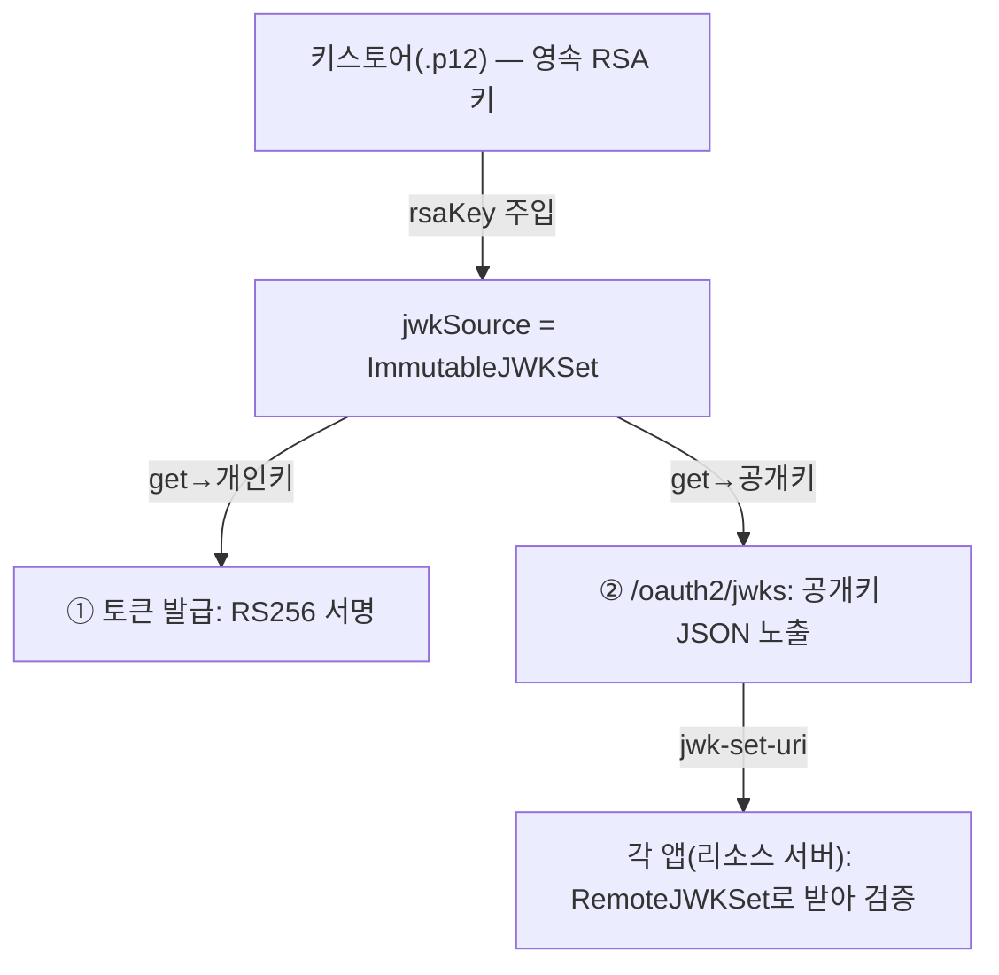

## 토큰 기반 vs 세션(쿠키) 기반

약어를 보기 전에, 왜 "토큰"인지부터. 로그인 상태를 기억하는 방식은 크게 둘이다.

| | 세션(쿠키) 기반 | 토큰(JWT) 기반 |
|---|---|---|
| 상태를 어디에 두나 | **서버**가 세션 저장(메모리·DB·Redis), 브라우저엔 세션 ID 쿠키만 | **토큰 안에** 정보가 들어있음, 서버는 저장 안 함 (stateless) |
| 검증 방법 | 매 요청마다 서버가 세션 저장소 조회 | 서명만 확인하면 끝 (저장소 조회 불필요) |
| 확장(scale-out) | 세션 공유 필요 (sticky session·Redis 등) | 어느 서버든 서명만 검증 → **공유 저장소 불필요** |
| 무효화(로그아웃) | 서버에서 세션 지우면 **즉시** 끝 | `exp` 전까지 유효 → **즉시 폐기 어려움** |
| 잘 맞는 곳 | 단일 서버·전통 웹앱 | MSA·여러 서비스가 한 토큰을 나눠 검증 |

핵심 맞교환은 **"서버 조회 없이 빠르고 잘 퍼지는 대신, 즉시 무효화가 어렵다"**. 서비스가 여럿이고 서로 다른 서버가 같은 토큰을 검증해야 하는 IdP 구조에선 이 stateless 성질이 결정적이라 토큰 기반을 쓴다. (즉시 무효화 한계는 아래 `NimbusJwtDecoder` 절에서 다시 다룬다.)

---

토큰 기반 인증에서 자꾸 마주치는 약어들 — JWT, JWK, JWKS, JWKSource — 은 한 줄로 구분된다.

| 약어 | 정체 |
|---|---|
| **JWT** | 서명된 토큰. `header.payload.signature` 3단 구조 |
| **JWK** | 암호화 키 하나를 JSON으로 표현한 것 (RSA 공개/개인키 한 쌍이 JWK 하나에 담길 수 있음) |
| **JWKS** | JWK 여러 개를 묶은 Set. `/oauth2/jwks` 엔드포인트가 노출하는 게 이것 |
| **JWKSource** | 그 JWK들을 **조건에 맞게 공급**하는 객체 (인터페이스) |

## JWT 토큰 구조

JWT는 점(`.`)으로 나뉜 세 덩어리다. 각각은 Base64URL 인코딩된 JSON(서명만 바이너리).

```text
eyJhbGciOiJSUzI1NiIsImtpZCI6ImlkcC1qd3QifQ   ← ① Header
.eyJzdWIiOiIxMDI5MyIsImF1dGhvcml0aWVzIjpbInJlcGFpcjp1c2VyIl19   ← ② Payload
.NHVQ...서명...                                ← ③ Signature
```

- **① Header** — 서명 알고리즘(`alg`, 예: `RS256`)과 키 식별자(`kid`). 검증자는 이 `kid`로 "어느 공개키로 검증할지" 고른다.
- **② Payload(클레임)** — 실제 데이터. `sub`(주체=userId), `iss`(발급자), `aud`(수신 대상), `exp`(만료), `nbf`(사용 시작), 그리고 커스텀 클레임(`authorities` 등).
- **③ Signature** — 헤더+페이로드를 발급자의 **개인키로 서명**한 값. 페이로드를 한 글자라도 바꾸면 서명이 깨지므로 **위변조를 막는다**(암호화가 아니라 무결성 보장 — payload는 누구나 디코딩해 읽을 수 있다).

> 📌 우리가 쓰는 "서명된 JWT"는 정확히는 **JWS**(JSON Web Signature)다. JWT엔 내용을 **암호화**하는 **JWE**(JSON Web Encryption)도 있는데, 인증 토큰은 보통 JWS를 쓴다 — payload를 가릴 필요는 없고 위변조만 막으면 되기 때문. 그래서 "JWT는 누구나 읽을 수 있다"가 성립한다. **민감정보를 payload에 넣지 말 것.**

### 검증해야 할 핵심 클레임

서명이 진짜여도 클레임을 안 보면 반쪽이다. 리소스 서버가 봐야 하는 것:

| 클레임 | 막는 것 | Spring Security 설정 |
|---|---|---|
| `iss` | 우리 IdP가 아닌 발급처의 토큰 | `issuer-uri` (자동으로 `iss` 검증) |
| `exp`/`nbf` | 만료됐거나 아직 유효하지 않은 토큰 | 기본 포함 (`JwtTimestampValidator`, 기본 60초 clock skew 허용) |
| `aud` | **다른 서비스용 토큰의 재사용** — A 서비스 토큰을 B에 들이미는 것 | `audiences` 별도 설정 |

`iss`만 검증하면 "우리 IdP 토큰"까지만 보장된다. 멀티앱이면 `aud`까지 봐야 "이 토큰이 *나에게* 발급된 게 맞다"가 보장된다.

## 왜 비대칭 키(RS256)인가 — JWKS가 존재하는 이유

서명 방식은 크게 둘이다. 이 선택이 곧 "왜 JWKS라는 게 필요한가"의 답이다.

| | 대칭 (HS256) | 비대칭 (RS256) |
|---|---|---|
| 키 | **하나**의 비밀키로 서명·검증 모두 | 개인키로 **서명**, 공개키로 **검증** (쌍) |
| 검증자에게 주는 것 | 그 비밀키 (= 서명도 가능) | 공개키만 (= 검증만 가능) |
| 멀티 서비스 | 리소스 서버 전부가 비밀키 보유 → **아무나 토큰 위조 가능** | 공개키는 새어도 위조 불가 |

리소스 서버가 여럿인 IdP 구조에서 HS256을 쓰면, 토큰을 검증하려고 모든 서비스에 **서명까지 가능한 비밀키**를 나눠줘야 한다 — 그중 하나만 뚫려도 전 서비스 토큰이 위조된다. 그래서 **개인키는 IdP만 갖고, 공개키만 배포**하는 RS256(비대칭)을 쓴다. 이 "공개키만 모아 공개하는 창구"가 바로 **JWKS 엔드포인트**다.

> ⚠️ **alg confusion 공격**: 공격자가 헤더의 `alg`를 `none`으로 바꾸거나, RSA 공개키를 HS256의 *비밀키*로 악용해 서명을 위조하려 든다. 방어는 **검증 측에서 허용 알고리즘을 RS256 하나로 못 박는 것**. 발급 측도 `RS256` 하나만 쓰고, 디코더도 그 알고리즘만 받게 제한한다.

## JWKSource — 키를 어디서 가져올지 추상화

`JWKSource`는 "필요한 서명 키(JWK)를 어디서 가져올지"를 추상화한 인터페이스다. Nimbus JOSE+JWT 라이브러리(`com.nimbusds`) 소속이고, Spring AS가 토큰에 **서명할 때 / 검증할 때** 키를 조달하는 통로다.

```java
public interface JWKSource<C extends SecurityContext> {
    // selector(필터/검색 조건: 예 "kid가 이거고 서명용(sig)인 RSA 키")를 받아
    //  → 조건에 맞는 키 목록을 돌려준다. 없으면 빈 리스트.
    List<JWK> get(JWKSelector jwkSelector, C context) throws KeySourceException;
}
```

메서드는 `get` 하나뿐. 키를 **어디서** 가져오는지는 구현체마다 다르므로 인터페이스로 추상화했다.

| 키 출처에 따른 구현 | 키 출처 | 용도 |
|---|---|---|
| `RemoteJWKSet` (`withJwkSetUri`) | 원격 jwks URL에서 HTTP로 | 리소스 서버(각 앱)가 IdP 키를 받을 때 |
| 단일 공개키 박기 (`withPublicKey`) | 고정 공개키 하나 | 키 하나만 고정 |
| `ImmutableJWKSet` (JWKSource 직접 주입) | 메모리에 고정된 Set | IdP 내부 — 영속 키 직접 사용 |

### ImmutableJWKSet — 영속 키를 메모리에 고정

IdP 본체에서는 세 번째, **이미 로드한 영속 키를 그대로 주입**하는 방식을 쓴다.

```java
@Bean
public JWKSource<SecurityContext> jwkSource(RSAKey rsaKey) {
    return new ImmutableJWKSet<>(new JWKSet(rsaKey));  // ← 영속 RSA 키를 불변 Set으로 고정
}
```

`ImmutableJWKSet`은 **부팅마다 새 키를 만들지 않고**, 키스토어에서 로드한 고정 키 하나를 불변 Set으로 박아둔다. 이후 `get()`이 몇 번 호출돼도 항상 같은 키를 돌려준다.

> 부팅마다 키를 새로 생성하면 재시작·재배포 시 기존 토큰이 전부 서명 검증에 실패한다(= 전 사용자 강제 로그아웃). 그래서 발급·검증 양쪽이 **같은 영속 키 한 쌍**을 공유해야 한다.

> 🔁 **회전의 한계**: `ImmutableJWKSet`에 키를 *하나만* 담으면 회전(rotation)이 불가능하다. 키를 교체하려면 **새 키엔 새 `kid`를 주고**(옛 `kid` 재사용 금지 — 캐시된 검증이 꼬인다), 전환 기간엔 **old+new 두 키를 JWKS에 함께 노출**해 새 키로만 서명하되 옛 토큰도 만료까지 검증되게 한다. 즉 진짜 회전을 하려면 `JWKSet(newKey, oldKey)`처럼 여러 키를 담는다.

키가 흐르는 경로:



## NimbusJwtDecoder — 받은 JWT를 검증하고 까기

`NimbusJwtDecoder`는 **받은 JWT 문자열을 검증하고 까서 `Jwt` 객체로 만들어주는** 디코더다. `JwtDecoder` 인터페이스(`Jwt decode(String token)` 메서드 하나)의 표준 구현체이며, 내부적으로 Nimbus 라이브러리로 파싱·서명검증을 한다. `final`이라 상속 불가 — 설정은 빌더/세터로만.

`decode("eyJ...")`를 호출하면 내부에서 3단계가 돈다.

1. **파싱** — JWT 문자열을 `header.payload.signature`로 분해
2. **서명 검증** — `JWKSource`에서 `kid`에 맞는 공개키를 찾아 RS256 서명이 진짜인지 확인
3. **클레임 검증** — `OAuth2TokenValidator`로 `exp`(만료)·`nbf`·`iss`(발급자) 등 검사

다 통과하면 `Jwt` 객체를 반환하고, 하나라도 실패하면 `JwtException`(`JwtValidationException`)을 던진다.

> 핵심은 **서명 검증(키)** 과 **클레임 검증(시간·발급자)** 이 분리돼 있다는 점이다. 키는 `JWKSource`가, 클레임은 `OAuth2TokenValidator`가 담당한다.

> ⚠️ **stateless의 대가 — 즉시 무효화가 안 된다.** 리소스 서버가 JWKS로 **로컬 검증**한다는 건 매 요청마다 IdP에 안 물어본다는 뜻이다. 덕분에 빠르지만, 토큰을 서버에서 강제 폐기(`/oauth2/revoke`)해도 **이미 발급된 access token은 `exp` 전까지 그대로 통과**한다. 즉시 차단이 필요하면 ① **짧은 access TTL**(예: 5~15분) + 긴 refresh, ② 매 요청 IdP에 확인하는 **introspection**, ③ 폐기 토큰 **denylist**(보통 Redis) 중 하나를 더한다.

IdP 내부에서는 발급에 쓰는 키와 검증에 쓰는 키가 완전히 동일하도록, 이미 가진 영속 `JWKSource`를 그대로 주입해 디코더를 만든다.

```java
@Bean
JwtDecoder jwtDecoder(JWKSource<SecurityContext> jwkSource, @Value("${app.issuer}") String issuer) {
    NimbusJwtDecoder decoder = (NimbusJwtDecoder)
            OAuth2AuthorizationServerConfiguration.jwtDecoder(jwkSource);   // ① 영속 키로 서명검증 세팅
    decoder.setJwtValidator(JwtValidators.createDefaultWithIssuer(issuer)); // ② iss + exp + nbf 검증기로 교체
    return decoder;
}
```

- **①** 우리 `jwkSource`(영속 RSA 키)로 디코더를 만들어 **서명 검증이 메모리 키를 쓰도록** 연결. 원격 호출 없이 바로 검증.
- **②** 기본 디코더는 `exp`·`nbf` 정도만 보는데, 여기에 **발급자(`iss`) 검사를 추가**한 검증기로 교체. "이 토큰의 `iss`가 우리 IdP(`app.issuer`)가 맞고, 안 만료됐고, 사용 시작 시각도 지났다"를 강제한다.

> 각 앱(리소스 서버)은 이 빈을 쓰지 않는다. 걔들은 `jwk-set-uri`로 IdP의 `/oauth2/jwks`를 받아 **각자의 디코더**로 검증한다("앱은 검증만"). 이 빈은 IdP 서버 내부에서 토큰을 다시 검증해야 하는 경로(OIDC userinfo 등)용이다.

## 정리

- JWT(=JWS) = `header.payload.signature`. 서명은 위변조를 막을 뿐 payload는 누구나 읽는다 → 민감정보 금지.
- 멀티 서비스라 **비대칭(RS256)** 을 쓴다. 개인키는 IdP만, 공개키는 JWKS로 배포 → 리소스 서버는 위조 못 하고 검증만.
- 검증은 서명(키, `JWKSource`) + 클레임(`iss`/`exp`/`nbf`/`aud`, `OAuth2TokenValidator`) 두 축.
- `ImmutableJWKSet`에 단일 키면 회전 불가 — 회전하려면 새 `kid` + old/new 동시 노출.
- JWT는 stateless라 **즉시 무효화가 안 된다** — 짧은 TTL·introspection·denylist로 보완.
- 관련: [Spring Authorization Server 핵심 빈 해부](/wiki/spring-authorization-server-beans/), [SecurityFilterChain과 FilterChainProxy](/wiki/spring-security-filter-chain/)
