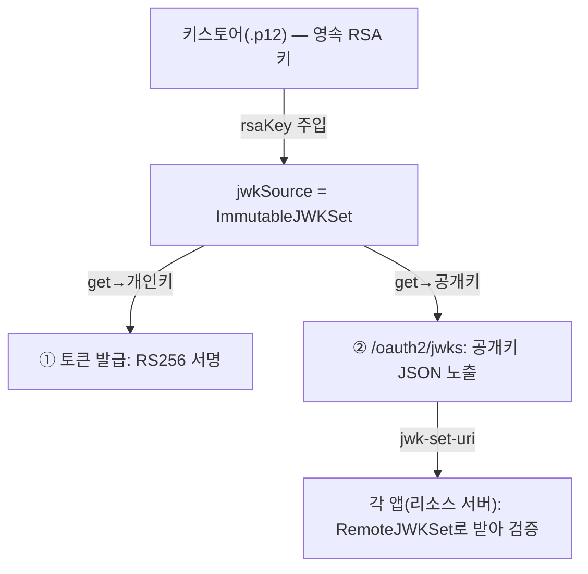

토큰 기반 인증에서 자꾸 마주치는 약어들 — JWT, JWK, JWKS, JWKSource — 은 한 줄로 구분된다.

| 약어 | 정체 |
|---|---|
| **JWT** | 서명된 토큰. `header.payload.signature` 3단 구조 |
| **JWK** | 암호화 키 하나를 JSON으로 표현한 것 (RSA 공개/개인키 한 쌍이 JWK 하나에 담길 수 있음) |
| **JWKS** | JWK 여러 개를 묶은 Set. `/oauth2/jwks` 엔드포인트가 노출하는 게 이것 |
| **JWKSource** | 그 JWK들을 **조건에 맞게 공급**하는 객체 (인터페이스) |

## JWT 토큰 구조

JWT는 점(`.`)으로 나뉜 세 덩어리다. 각각은 Base64URL 인코딩된 JSON(서명만 바이너리).

```text
eyJhbGciOiJSUzI1NiIsImtpZCI6ImlkcC1qd3QifQ   ← ① Header
.eyJzdWIiOiIxMDI5MyIsImF1dGhvcml0aWVzIjpbInJlcGFpcjp1c2VyIl19   ← ② Payload
.NHVQ...서명...                                ← ③ Signature
```

- **① Header** — 서명 알고리즘(`alg`, 예: `RS256`)과 키 식별자(`kid`). 검증자는 이 `kid`로 "어느 공개키로 검증할지" 고른다.
- **② Payload(클레임)** — 실제 데이터. `sub`(주체=userId), `iss`(발급자), `exp`(만료), `nbf`(사용 시작), 그리고 커스텀 클레임(`authorities` 등).
- **③ Signature** — 헤더+페이로드를 발급자의 **개인키로 서명**한 값. 페이로드를 한 글자라도 바꾸면 서명이 깨지므로 **위변조를 막는다**(암호화가 아니라 무결성 보장 — payload는 누구나 디코딩해 읽을 수 있다).

## JWKSource — 키를 어디서 가져올지 추상화

`JWKSource`는 "필요한 서명 키(JWK)를 어디서 가져올지"를 추상화한 인터페이스다. Nimbus JOSE+JWT 라이브러리(`com.nimbusds`) 소속이고, Spring AS가 토큰에 **서명할 때 / 검증할 때** 키를 조달하는 통로다.

```java
public interface JWKSource<C extends SecurityContext> {
    // selector(필터/검색 조건: 예 "kid가 이거고 서명용(sig)인 RSA 키")를 받아
    //  → 조건에 맞는 키 목록을 돌려준다. 없으면 빈 리스트.
    List<JWK> get(JWKSelector jwkSelector, C context) throws KeySourceException;
}
```

메서드는 `get` 하나뿐. 키를 **어디서** 가져오는지는 구현체마다 다르므로 인터페이스로 추상화했다.

| 키 출처에 따른 구현 | 키 출처 | 용도 |
|---|---|---|
| `RemoteJWKSet` (`withJwkSetUri`) | 원격 jwks URL에서 HTTP로 | 리소스 서버(각 앱)가 IdP 키를 받을 때 |
| 단일 공개키 박기 (`withPublicKey`) | 고정 공개키 하나 | 키 하나만 고정 |
| `ImmutableJWKSet` (JWKSource 직접 주입) | 메모리에 고정된 Set | IdP 내부 — 영속 키 직접 사용 |

### ImmutableJWKSet — 영속 키를 메모리에 고정

IdP 본체에서는 세 번째, **이미 로드한 영속 키를 그대로 주입**하는 방식을 쓴다.

```java
@Bean
public JWKSource<SecurityContext> jwkSource(RSAKey rsaKey) {
    return new ImmutableJWKSet<>(new JWKSet(rsaKey));  // ← 영속 RSA 키를 불변 Set으로 고정
}
```

`ImmutableJWKSet`은 **부팅마다 새 키를 만들지 않고**, 키스토어에서 로드한 고정 키 하나를 불변 Set으로 박아둔다. 이후 `get()`이 몇 번 호출돼도 항상 같은 키를 돌려준다.

> 부팅마다 키를 새로 생성하면 재시작·재배포 시 기존 토큰이 전부 서명 검증에 실패한다(= 전 사용자 강제 로그아웃). 그래서 발급·검증 양쪽이 **같은 영속 키 한 쌍**을 공유해야 한다.

키가 흐르는 경로:



## NimbusJwtDecoder — 받은 JWT를 검증하고 까기

`NimbusJwtDecoder`는 **받은 JWT 문자열을 검증하고 까서 `Jwt` 객체로 만들어주는** 디코더다. `JwtDecoder` 인터페이스(`Jwt decode(String token)` 메서드 하나)의 표준 구현체이며, 내부적으로 Nimbus 라이브러리로 파싱·서명검증을 한다. `final`이라 상속 불가 — 설정은 빌더/세터로만.

`decode("eyJ...")`를 호출하면 내부에서 3단계가 돈다.

1. **파싱** — JWT 문자열을 `header.payload.signature`로 분해
2. **서명 검증** — `JWKSource`에서 `kid`에 맞는 공개키를 찾아 RS256 서명이 진짜인지 확인
3. **클레임 검증** — `OAuth2TokenValidator`로 `exp`(만료)·`nbf`·`iss`(발급자) 등 검사

다 통과하면 `Jwt` 객체를 반환하고, 하나라도 실패하면 `JwtException`(`JwtValidationException`)을 던진다.

> 핵심은 **서명 검증(키)** 과 **클레임 검증(시간·발급자)** 이 분리돼 있다는 점이다. 키는 `JWKSource`가, 클레임은 `OAuth2TokenValidator`가 담당한다.

IdP 내부에서는 발급에 쓰는 키와 검증에 쓰는 키가 완전히 동일하도록, 이미 가진 영속 `JWKSource`를 그대로 주입해 디코더를 만든다.

```java
@Bean
JwtDecoder jwtDecoder(JWKSource<SecurityContext> jwkSource, @Value("${app.issuer}") String issuer) {
    NimbusJwtDecoder decoder = (NimbusJwtDecoder)
            OAuth2AuthorizationServerConfiguration.jwtDecoder(jwkSource);   // ① 영속 키로 서명검증 세팅
    decoder.setJwtValidator(JwtValidators.createDefaultWithIssuer(issuer)); // ② iss + exp + nbf 검증기로 교체
    return decoder;
}
```

- **①** 우리 `jwkSource`(영속 RSA 키)로 디코더를 만들어 **서명 검증이 메모리 키를 쓰도록** 연결. 원격 호출 없이 바로 검증.
- **②** 기본 디코더는 `exp`·`nbf` 정도만 보는데, 여기에 **발급자(`iss`) 검사를 추가**한 검증기로 교체. "이 토큰의 `iss`가 우리 IdP(`app.issuer`)가 맞고, 안 만료됐고, 사용 시작 시각도 지났다"를 강제한다.

> 각 앱(리소스 서버)은 이 빈을 쓰지 않는다. 걔들은 `jwk-set-uri`로 IdP의 `/oauth2/jwks`를 받아 **각자의 디코더**로 검증한다("앱은 검증만"). 이 빈은 IdP 서버 내부에서 토큰을 다시 검증해야 하는 경로(OIDC userinfo 등)용이다.

## 정리

- JWT = `header.payload.signature`. 서명은 위변조를 막을 뿐 payload는 누구나 읽는다.
- JWK(키 1개) → JWKS(Set) → `JWKSource`(키 공급 추상화). IdP는 영속 키를 박은 `ImmutableJWKSet`을 발급·검증에 함께 쓴다.
- `NimbusJwtDecoder.decode()` = 파싱 + 서명 검증(키) + 클레임 검증(시간·발급자).
- 관련: [Spring Authorization Server 핵심 빈 해부](/wiki/spring-authorization-server-beans/), [SecurityFilterChain과 FilterChainProxy](/wiki/spring-security-filter-chain/)
