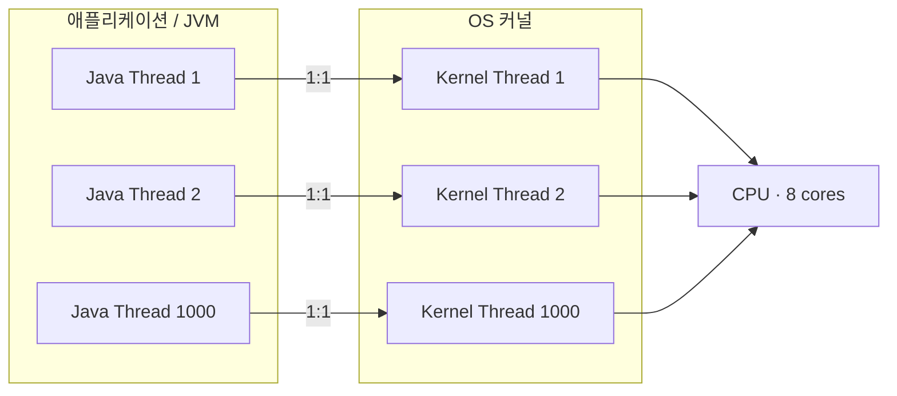
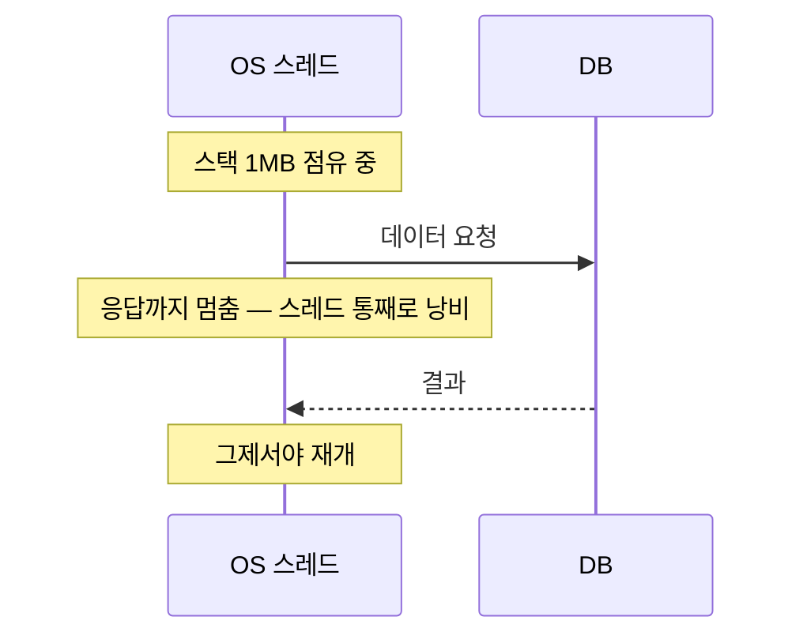
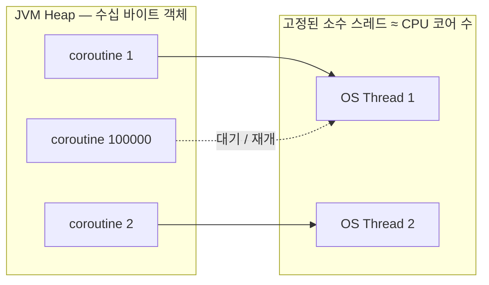
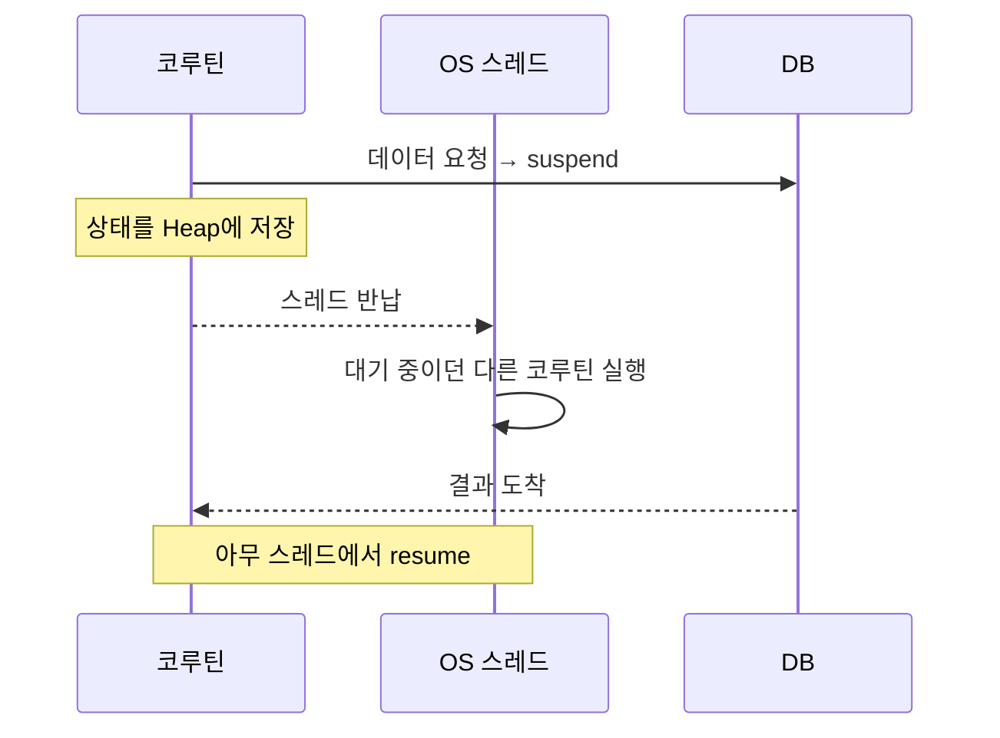

같은 "동시에 여러 요청 처리"라도 **Java의 전통적 스레드**와 **코틀린 코루틴**은 자원을 쓰는 방식이 완전히 다르다. 차이를 이해하려면 먼저 "스레드가 실제로 무엇인지"부터 봐야 한다.

> 스레드·프로세스의 기본은 [프로세스 vs 스레드](/wiki/process-thread/) 참고.

## 1. 진짜 스레드는 OS 커널이 관리한다

- **커널(Kernel)** — OS의 핵심. CPU를 어떤 작업에 얼마나 줄지, 메모리를 어떻게 나눌지를 독점 관리한다.
- **커널 수준 스레드** — 소프트웨어가 만든 가짜가 아니라 커널이 직접 인식·관리하는 진짜 실행 단위. **CPU 코어에 실제로 올라가 연산하는 유일한 단위**다.

무슨 언어를 쓰든 연산은 결국 커널 스레드가 CPU 위에서 한다. 언어들의 차이는 **이 비싼 커널 스레드를 어떻게 쓰느냐**에 있다.

## 2. Java — 스레드 1:1 매핑

`new Thread()`나 `ExecutorService`로 스레드를 만들면, JVM은 스스로 스레드를 못 만들고 **OS 커널에게 진짜 스레드를 하나 달라고 요청**한다. 자바 스레드 1개 = OS 스레드 1개. 이게 **1:1 매핑**이다.

이 모델은 세 가지 비용을 낳는다.

### ① 스택 메모리 1MB / 스레드
스레드마다 자기만의 **스택**(실행 중인 함수, 지역 변수)을 갖는다. Java는 기본 약 **1MB**. 동시 요청 1,000개를 위해 스레드 1,000개를 만들면 아무 일을 안 해도 **약 1GB**가 점유된다.

### ② 컨텍스트 스위칭
코어는 8개인데 스레드가 1,000개면 CPU가 빠르게 번갈아 실행해야 한다. 스레드를 바꿀 때마다 직전 스레드의 레지스터 상태를 저장하고 다음 스레드 상태를 불러오는데, 이게 **커널이 개입하는 무거운 작업**이다. 스레드가 많아질수록 실제 로직보다 **스위칭 비용**에 CPU를 더 쓴다.

### ③ 블로킹
스레드가 "DB에서 회원 정보 가져와" 같은 I/O를 만나면 응답이 올 때까지 **멈춰 대기**한다(블로킹). 1MB를 들여 만든 스레드가 일은 안 하고 묶여만 있는 셈이다.

## 3. Kotlin — 코루틴

코루틴은 "스레드 더 줘"라고 커널에 요청하지 않는다. **이미 받아둔 소수의 OS 스레드(보통 CPU 코어 수만큼)** 만 고정해 두고, 그 위에서 돌릴 **작업 단위(코루틴)** 를 컴파일러·라이브러리가 직접 쪼개 관리한다. 커널은 코루틴의 존재를 모른다 — JVM 내부(유저 수준)의 일이다.

**가벼운 객체** — 코루틴은 1MB 스택이 아니라 JVM **힙(Heap)** 에 올라가는 **수십 바이트짜리 객체**다. "몇 번째 줄까지 실행했는지 + 그때의 변수"만 담는다. 그래서 한 스레드에서 **코루틴 10만 개**도 거뜬하다.

### suspend / resume — 논블로킹의 실체
- **suspend(일시 중단)** — 코루틴이 I/O를 만나면 스레드를 붙잡고 같이 멈추는 게 아니라 **"나 잠깐 멈출 테니 넌 다른 일 해"** 하고 스레드를 놔준다. 자기 상태는 힙에 저장.
- **제어권 전환** — 자유로워진 스레드는 힙에서 대기 중이던 **다른 코루틴**을 바로 실행. 커널이 개입하는 무거운 컨텍스트 스위칭이 아니라 **JVM 안에서 객체 참조만 바꾸는 수준**이라 비용이 거의 0.
- **resume(재개)** — DB 응답이 오면 **마침 놀고 있는 아무 스레드**가 그 코루틴을 다시 꺼내 멈췄던 지점부터 이어 실행.

## 4. 한눈에 비교

| | Java 스레드 | Kotlin 코루틴 |
|---|---|---|
| 실행 단위 | OS 커널 스레드 (1:1) | 힙 위의 가벼운 객체 |
| 1개당 메모리 | 스택 약 1MB | 수십 바이트 |
| 스케줄링 주체 | OS 커널 | JVM(유저 수준) 라이브러리 |
| 전환 비용 | 무거운 컨텍스트 스위칭 | 객체 참조 변경 수준 (≈0) |
| I/O 대기 | 블로킹 — 스레드 묶임 | suspend — 스레드 반납 |
| 동시 1만+ | 메모리·스위칭으로 한계 | 거뜬 |

## 5. 보너스 — Java도 가벼워진다 (Virtual Thread)

"Java는 안 되고 Kotlin만 된다"는 얘기가 아니다. **Java 21의 Virtual Thread(Project Loom)** 도 같은 아이디어다 — 다수의 가벼운 가상 스레드를 소수의 OS 스레드(carrier) 위에 얹고, 블로킹 I/O를 만나면 OS 스레드를 반납한다. 접근법(언어 키워드 vs 런타임)이 다를 뿐, **"비싼 커널 스레드를 아끼자"** 는 방향은 같다.

> **핵심**: 연산은 결국 비싼 커널 스레드가 한다. 그 스레드를 1:1로 늘리면(전통 Java) 메모리·스위칭·블로킹으로 무너지고, 가벼운 작업 단위를 그 위에 얹어 대기 중엔 스레드를 반납하면(코루틴·가상 스레드) 같은 자원으로 훨씬 많은 동시성을 낸다.
